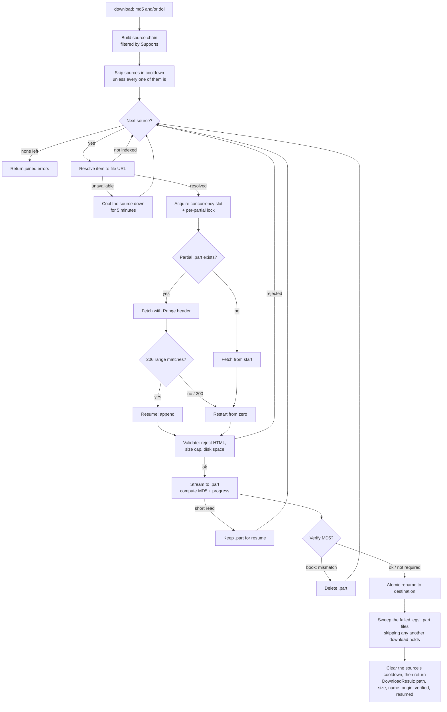

# Architecture

`libgen-mcp` federates a set of bibliographic catalogs and open-access providers behind four
MCP tools. Underneath, it is a thin server around an HTTP client for the primary catalog's
`libgen.li` mirror family, plus a set of pluggable download sources. This page describes the
three pieces that do the work: the resilient **HTTP client** (mirror discovery, failover,
retry, cooldown), the **download pipeline** (resolve → stream → resume → verify → atomic
rename), and the **multi-source chain**.

## HTTP client

Page-level requests (`search`, `get_details`, and the LibGen link resolution used by
downloads) go through a single client that makes the mirror family look like one reliable
endpoint.

### Outbound address policy

Almost every URL this server fetches was chosen by someone else: a publisher's full-text link
deposited with Crossref, a repository's download URL republished by Unpaywall, OpenAlex or
CORE, a `citation_pdf_url` scraped off a publisher page. Nothing in that pipeline stops one of
those URLs from naming the loopback interface, the operator's LAN, or a cloud
instance-metadata endpoint — and if it did, the server would be acting as a proxy into a
network the depositor could never reach directly. That is server-side request forgery, and
`internal/netguard` is where it is refused.

The check lives in the dialer's `Control` hook rather than on the URL, because only the dialer
sees what the name actually resolved to. A URL-level check is defeated by a public hostname
with a private `A` record and by DNS rebinding; the `Control` hook is handed the concrete IP
microseconds before `connect`. Blocked: loopback, `0.0.0.0/8`, the IPv4 broadcast address,
link-local unicast and multicast (`169.254.0.0/16`, which contains `169.254.169.254`, and
`fe80::/10`), every multicast scope, RFC 1918 and RFC 4193 private space, and RFC 6598
carrier-grade NAT — each also in its IPv4-mapped IPv6 disguise.

Because the policy is installed on the shared `Transport`, every download source, every
liveness probe, every discovery provider and every mirror lookup inherits it at once, rather
than each having to remember. A complementary redirect policy bounds the chain at five hops
and strips `Authorization` and `Cookie` whenever a redirect changes host — which is the one
protection the dialer cannot give, since `net/http` keeps those headers for any _subdomain_ of
the original.

`LIBGEN_MCP_ALLOW_PRIVATE_ADDRESSES=true` lifts it, for the one legitimate case: an operator
running their own mirror on their own network. It is off by default and applies to every
source at once, in both directions.

### Mirror discovery

Candidate mirrors are supplied by a `Manager`:

- The live list is fetched from the
  [shadowlibraries](https://shadowlibraries.github.io/DirectDownloads/libgen/) directory and
  cached for **24 hours** in the OS cache directory
  (`~/.cache/libgen-mcp/mirrors.json` on Linux, `~/Library/Caches/libgen-mcp/mirrors.json`
  on macOS).
- On startup the manager prefers, in order: a valid disk cache, a live fetch (which it then
  writes to cache), a stale cache, and finally a hardcoded fallback list. Only the fallback
  is not memoized, so the next request retries discovery instead of pinning to it.
- The preferred mirror (`libgen.li` by default, or `LIBGEN_MIRROR` when set) is always
  placed first. Setting `LIBGEN_MIRROR` moves that host to the front; discovery still runs and the rest of the
  list stays available for failover.
- A long-running server re-discovers once the in-memory list exceeds its 24-hour TTL, so it
  picks up mirror changes without a restart.

### Failover, retry, and cooldown

For each page request the client sweeps the candidate mirrors, preferred first, and
classifies every failure:

- **Transient** (network error, timeout, HTTP 5xx, or 429): the mirror is put in a
  **45-second cooldown** and the request is retried on the next pass, up to
  `LIBGEN_MCP_RETRY_ATTEMPTS` passes, with a growing backoff (base 200 ms, doubling per
  attempt, capped at 30 s, plus jitter).
- **Permanent** (a 4xx other than 429, e.g. 404/403): the mirror is removed from the
  remaining passes and the request fails over to the next candidate immediately — no
  cooldown, no backoff.

When a mirror is in cooldown it is skipped; if every eligible mirror is cooling down, the
full list is tried anyway (better than nothing). The outcome is distinguished so the caller
can react correctly:

- `ErrAllMirrorsFailed` — at least one transient failure occurred: a genuine connectivity
  problem.
- `ErrRequestRejected` — every mirror returned a permanent error: a normal "not found /
  rejected", not a network alarm.

All outbound requests (page requests and file streams alike) pass through a shared
token-bucket rate limiter sized by `LIBGEN_MCP_RATE_RPS` and `LIBGEN_MCP_RATE_BURST`.

## Download pipeline

Downloads use a separate HTTP client with **no global timeout** — long transfers are bounded
by the request context and a progress-aware stall guard, not a fixed deadline. Concurrency is
capped by a semaphore of size `LIBGEN_MCP_MAX_CONCURRENT_DOWNLOADS`; extra downloads queue for
a slot (and can be canceled while queued, before touching the network).

### Start-retries and the stall guard

Two mechanisms make downloads resilient without ever cutting a healthy transfer:

- **Staged start-retries.** Getting a download to _begin_ — resolving a fresh URL, connecting,
  and pulling the first byte — is retried on a schedule (`LIBGEN_MCP_DOWNLOAD_START_RETRY_WAITS`,
  default `5s,5s,5s,10s,10s,10s,15s`: 8 attempts over ~60 s). A resolve error, connection error,
  non-2xx status, or a 2xx response that yields no bytes is retried; each retry resolves afresh
  so an expired key is renewed. The moment bytes flow, start-retries stop and streaming begins.
  This wraps a _single_ source attempt — the multi-source chain still advances to the next
  source when one is exhausted. When every source fails to start, the download returns an
  actionable error (`errDownloadCouldNotStart`) guiding the caller to retry now, retry later, or
  ask the user.
- **Progress-resetting stall timeout.** While streaming, a download is aborted only when **no**
  bytes arrive within `LIBGEN_MCP_DOWNLOAD_STALL_TIMEOUT` (default 60 s). Every received byte
  resets the window, so a slow-but-progressing transfer (20–50 kB/s is common) is never cut,
  while a truly dead connection is dropped after the window with its `.part` kept for resume. It
  is implemented as a read guard that cancels the transfer's context on stall — the per-request
  `LIBGEN_MCP_TIMEOUT` is never applied to a stream. Caller (LLM) cancellation aborts promptly.

For a given item the pipeline:

1. **Resolves** the item against a source to a concrete, streamable URL (plus any headers,
   a verify-MD5 flag, and a fallback extension).
2. Computes a deterministic **partial (`.part`) path**, namespaced by source name and a key
   (the MD5 for books, or a hash of the DOI/URL otherwise), and takes a per-partial lock so
   two downloads of the same target never corrupt each other.
3. **Fetches** the file under the start-retry schedule (re-resolving on each attempt); if bytes
   are already on disk it sends a `Range` header to **resume** from that offset.
4. Inspects the response: a `206` whose `Content-Range` start matches the existing bytes
   resumes; a `200` restarts from zero; anything else is a failure.
5. **Validates** the response — rejects HTML error pages (by `Content-Type` and by sniffing
   the first 512 bytes), enforces the size cap against the full expected size, and checks
   free disk space.
6. **Streams** the body into the `.part` file while computing its MD5 and reporting throttled
   progress, under the progress-resetting stall guard. On resume it re-hashes the bytes already
   on disk so the final digest covers the whole file.
7. **Verifies** (for MD5-keyed sources) the digest against the requested MD5. A mismatch or
   an oversized transfer deletes the partial; a transient short read keeps it so a later call
   can resume.
8. **Atomically renames** the completed `.part` to the final destination, then **sweeps** the
   partials the failed legs of this call left behind: a partial is only worth keeping while the
   item is still unresolved, and once a source delivers the file the rest are litter in the
   caller's download directory. Each removal takes that path's lock and skips the partial when
   another download holds it, so a concurrent transfer is never unlinked from under.

An explicit `filename` always wins. With none, the name turns on whether the bytes were
digest-verified: a **verified** (`md5`) download is named `Author - Title (Year).ext` from the
record, while an **unverified** (`doi`/`isbn`) one keeps the announced `Content-Disposition`
name stripped of mirror marks and falls back to the requested identifier — naming an unverified
delivery after the record that was asked for would dress a wrong file in the right name. Every
name is sanitized, with a source-provided extension appended when it has none. See
[Tools](tools.md#how-the-saved-file-is-named) for the full rule.

### Download flow

The destination name is chosen by the verified/unverified rule above — which on an
**unverified** download does use the announced `Content-Disposition` name, stripped of mirror
marks, and never does on a verified one — and the result reports which of the four origins it
came from in `name_origin`. The result reports **no** source and **no** mirror: both remain
server-side, on the `source resolved` log line, because
a tool result may reveal only what the call already revealed. A `resolve_only` call is the one
exception the rule allows — it returns a direct URL instead of a saved file, and that URL's own
host names the provider, so `resolved.source` travels beside it. See
[Tools](tools.md#what-the-result-withholds) and
[the result-disclosure ADR](decisions/2026-08-08-result-reveals-only-what-the-call-revealed.md).

## Multi-source chain

Download sources implement a common interface — `Name`, `Supports(item)`, and
`Resolve(ctx, item)` — so the shared pipeline stays provider-agnostic. The chain is built
from configuration in the fixed order `unpaywall → openalex → europepmc → biorxiv → rfc → nist → dagstuhl → acl → zenodo → scielo → fao → fatcat → core → crossref → oapen → archive → scihub → scidb → libgen → randombook → annas`, and each
source is offered only the items it supports:

| Source       | Keyed by                       | Role                    | In one line                                                                                             |
| ------------ | ------------------------------ | ----------------------- | ------------------------------------------------------------------------------------------------------- |
| `unpaywall`  | DOI                            | Open-access articles    | The best open-access PDF link the Unpaywall API knows for a DOI.                                        |
| `openalex`   | DOI                            | Open-access articles    | The same open-access index as Unpaywall, reached with no credential at all.                             |
| `europepmc`  | DOI                            | Open-access articles    | PubMed Central's open-access full text, via the Europe PMC search API.                                  |
| `biorxiv`    | `10.1101` DOI                  | Open-access preprints   | The latest version's `.full.pdf` on bioRxiv or medRxiv.                                                 |
| `rfc`        | `10.17487` DOI                 | Internet standards      | The RFC Editor's canonical `.txt`, built from the RFC number.                                           |
| `nist`       | `10.6028` DOI                  | NIST standards          | The DOI resolver's redirect, which ends at the PDF on `nvlpubs.nist.gov`.                               |
| `dagstuhl`   | `10.4230` DOI                  | Open-access proceedings | LIPIcs, OASIcs, DARTS and the Dagstuhl Reports, off the DROPS document page.                            |
| `acl`        | `10.18653/v1`/`10.3115/v1` DOI | Open-access proceedings | `aclanthology.org/<id>.pdf`, built from the identifier the DOI embeds.                                  |
| `zenodo`     | `10.5281/zenodo` DOI           | Open-access deposits    | The best file in the record, listed through the one `/api` path robots.txt allows.                      |
| `scielo`     | `10.1590` DOI                  | Open-access articles    | SciELO Brazil's own PDF, off the article page the DOI resolves to.                                      |
| `fao`        | `10.4060` DOI                  | UN agency documents     | The FAO Knowledge Repository item's bitstream, reached through the one REST endpoint robots.txt allows. |
| `fatcat`     | DOI                            | Preserved full text     | Internet Archive Scholar's preserved copies, each probed before use.                                    |
| `core`       | DOI                            | Open-access articles    | CORE's download URL, returned only when it still serves a live copy.                                    |
| `crossref`   | DOI                            | Publisher-deposited     | The full-text link the publisher deposited with Crossref, probed before use.                            |
| `oapen`      | DOI/ISBN                       | Open-access books       | An openly licensed monograph, after OAPEN's record confirms the identifier.                             |
| `archive`    | ISBN                           | Public-domain books     | An Internet Archive scan, only when public and not lending-restricted.                                  |
| `scihub`     | DOI                            | Article fallback        | The PDF embedded by the first Sci-Hub mirror that serves an article page.                               |
| `scidb`      | DOI                            | Article fallback        | The PDF embedded in Anna's Archive's SciDB viewer.                                                      |
| `libgen`     | MD5                            | Primary book provider   | The LibGen link chain (`ads.php` → `get.php` → CDN), with MD5 verification.                             |
| `randombook` | MD5                            | Book fallback           | Fresh libgen-family mirrors discovered through the randombook.org API.                                  |
| `annas`      | MD5                            | Book fallback           | Anna's Archive over public IPFS gateways, or the member API when a key is set.                          |

Two of these are off by default: `unpaywall` needs `LIBGEN_MCP_UNPAYWALL_EMAIL` and `core`
needs `LIBGEN_MCP_CORE_KEY`, and without those an unconfigured deployment does not have them
in the chain at all. For what each source reaches, how it resolves an identifier, the traps
measured against it and the crawl rules it observes, see [Download sources](sources.md) — this
table is only the index.

Because the chain is a single ordered slice filtered by `Supports`, an md5-keyed book item is
offered `[libgen, randombook, annas]`, an ISBN-keyed one `[oapen, archive]`, an article item
`[unpaywall, openalex, europepmc, biorxiv, rfc, nist, dagstuhl, acl, zenodo, scielo, fao, fatcat, core, crossref, oapen, scihub,
scidb]`, and an item carrying both
an md5 and a DOI is offered article sources first, then book sources. `LIBGEN_MCP_SOURCES` removes sources from
this chain without reordering it. `Download` tries each supporting source in turn and returns
the first success; if all fail, it returns the joined per-source errors.

### Per-source cooldown

A source that fails because it is **unavailable** — a transport error, a timeout, a 5xx or a
429 — is set aside for 5 minutes, so the next download does not spend its resolve budget
(`LIBGEN_MCP_RESOLVE_BUDGET`, default 30 s per source) on a
provider that just proved unreachable. This is the source-level counterpart of the per-mirror
cooldown in the HTTP client, and it matters most for a service that is down for hours at a
time: without it, every article download pays the full per-source budget for that provider
again and again.

A source that answers correctly that it does **not hold the item** — not indexed, not open
access, no preserved copy — is never set aside: that is a normal, correct answer about one
item and says nothing about the provider's health. The two cases are told apart by the error
taxonomy each source tags its failures with (`ErrSourceUnavailable` vs `ErrNotIndexed`).

Two rules bound the behavior:

- A cooldown only deprioritizes. When **every** source able to serve an item is in cooldown,
  the chain tries them all anyway — better to try than nothing — and says so in the log. An
  explicit `source:` argument therefore always reaches the source it names.
- A success lifts it. A source that just served a file is not unavailable, so serving one
  clears its cooldown.
- Nothing is persisted. The state lives on the client for the life of the process, so a
  restart starts clean.

Both decisions are visible in the log alongside the existing per-source attempt lines: a
skipped source is reported at `INFO` with the instant its cooldown expires, and an
all-cooled-down bypass at `WARN`.

## Search path

The download chain above is one of two federations in the server. The other is the search
path, which is structured differently: the download chain is ordered and stops at the first
success, while the searchers run concurrently and their answers are merged.

A search always queries the Library Genesis catalog through the same failover client. Whether
it also queries the **extra searchers** — Anna's Archive plus the keyless open-access
providers (arXiv, Crossref, OpenLibrary), the bibliographic indexes (dblp, PubMed) and ERIC — is
decided by `ExtraSourcesMode`, resolved per call from the `extra_sources` argument and falling
back to `LIBGEN_MCP_EXTRA_SOURCES`:

| Mode     | When the extras run                            | Scheduling                                                              |
| -------- | ---------------------------------------------- | ----------------------------------------------------------------------- |
| `auto`   | Only when the catalog returns nothing or fails | After the catalog, since the decision depends on the catalog's answer   |
| `always` | Every search                                   | Concurrently with the catalog, since the decision does not depend on it |
| `never`  | Never                                          | —                                                                       |

Each extra searcher implements `discovery.Provider` (`Name`, `Search`), and `Federate` runs
the set concurrently with per-provider panic recovery, so one failing provider cannot fail the
search. The merge is keyed by identifier space: Anna's hits carry an md5 and join `results`
labeled `origin: "annas"`, while the open-access hits carry a DOI and stay in `open_access`.
Duplicates are dropped by md5, and a file present in both the catalog and Anna's keeps the
catalog record, which carries the richer metadata.

ERIC is a searcher with no matching download source, and deliberately so. Its contribution is
education grey literature — reports, dissertations, agency documents — which carries no DOI,
so it fits neither key space the download chain understands. It needs neither: ERIC serves
every full text it holds from a URL derived from the record's accession number, so a hit
arrives with its `pdf_url` already filled in and there is nothing for a `Resolve` to resolve.
Adding an ERIC identifier to `Item`, `download` and `read` would have widened three schemas to
wrap a string concatenation. See
[the source-and-capability-scope ADR](decisions/2026-07-22-source-and-capability-scope.md).

`get_details` follows the same split. An md5 the catalog has no record for — which is what an
escalated search returns — falls back to Anna's own record page, parsed by label rather than
by position because the field set varies by source collection.

For the conceptual walk-through with diagrams, see [How search works](how-search-works.md).

## Transports

The server speaks MCP over one of two transports, selected at startup:

- **stdio (default).** With no `--http` flag the server runs over stdio, reading requests on
  stdin and writing responses on stdout (logs go to stderr). This is the mode MCP clients
  such as Claude Code, Claude Desktop, Cursor, and VS Code use: the client launches the
  binary as a child process and speaks to it locally, one client per process.
- **streamable HTTP (opt-in).** Started with `--http host:port` (for example
  `libgen-mcp --http :8080`), the server instead serves the streamable HTTP transport,
  suitable for running centrally and connecting remote HTTP-capable clients. In this mode it
  also mounts a `GET /health` readiness endpoint that returns `200` and a JSON body, plus the
  server card at `GET /.well-known/mcp/server-card.json`, while the
  server is serving — handy for container and load-balancer health checks.

Both transports share the same tools, HTTP client, and download pipeline; only the
request/response channel differs. Termination signals (SIGINT/SIGTERM) drain in-flight work
and shut the active transport down gracefully. Because a `--http` server runs elsewhere and
cannot write to the client's disk, it flips `download` into remote download mode: every call
returns a link (a `resource_link` plus a `resolved` object) instead of saving a file. See
[Tools](tools.md#where-the-file-goes-local-vs-remote) for details.

### Stateless mode

The HTTP transport is **stateless by default**
([SEP-2567](https://github.com/modelcontextprotocol/modelcontextprotocol/pull/2567)): the
server neither reads nor sets `Mcp-Session-Id`, every POST is a self-contained request served
by a temporary session, and `GET`/`DELETE` on the MCP endpoint answer
`405 Method Not Allowed` with `Allow: POST`. `GET /health` is a separate route and is
unaffected. Stateless is what MCP protocol `2026-07-28` requires over HTTP; the session-based
transport negotiates `2025-11-25` or older.

It suits this server: there is no authentication and no per-client state, so a single shared
MCP server answers every request and a session bought nothing. Sessionless also means any
number of replicas can sit behind a plain round-robin load balancer with no sticky routing.

| Flag                       | Default | What it does                                                                                                                                                                 |
| -------------------------- | ------- | ---------------------------------------------------------------------------------------------------------------------------------------------------------------------------- |
| `--stateless`              | `true`  | Serve sessionless streamable HTTP. `--stateless=false` restores the legacy session transport, and clients then negotiate protocol `2025-11-25` or older.                     |
| `--json-response`          | `false` | Return `application/json` response bodies instead of `text/event-stream` (SSE).                                                                                              |
| `--max-request-body-bytes` | `0`     | Cap request bodies in bytes; a request over the cap gets `413`. `0` uses the SDK default of 4 MiB. A negative value is rejected at startup — it would lift the cap entirely. |

**Request cancellation.** A client that disconnects mid-call cancels the handler's context,
so an abandoned mirror fetch stops instead of running to completion. The SDK applies this
only to protocol-`2026-07-28` requests, so older clients are unaffected.

**Cache hints.** `tools/list`, `prompts/list` and `server/discover` carry a
[SEP-2549](https://github.com/modelcontextprotocol/modelcontextprotocol/pull/2549) hint of
`ttlMs: 3600000` (one hour) at the default `cacheScope: "public"`. The catalog is compiled
into the binary and identical for every client — no authentication, no per-client filtering —
so a shared intermediary may cache it too.

**Elicitation.** A stateless session starts from default initialization parameters, so a
**legacy** client is not seen as supporting elicitation and the download-consent question
falls back to its deterministic default. Clients on protocol `2026-07-28` use the MRTR
ask/answer flow carried in the tool result itself, which needs no session and keeps working.
Serve with `--stateless=false` if you must keep the old elicitation path for legacy clients.

**No param-header routing.** Tool arguments are passed in the JSON-RPC body only: nothing on
this surface carries an [SEP-2243](https://github.com/modelcontextprotocol/modelcontextprotocol/pull/2243)
`x-mcp-header` annotation. Annotating `md5` is the obvious candidate and is deliberately not
done — the annotation obliges the client to mirror the value into an `Mcp-Param-Md5` header
and the server to reject the call without it, which browser-based clients structurally cannot
satisfy. See
[the decision record](decisions/2026-07-31-no-param-header-routing.md) for the measurements.

To check a deployment behaves as described, run `make validate-http-stateless` (or
`scripts/validate-http-stateless.sh docker` to exercise the container entrypoint): it starts
a real server and asserts each guarantee above over the wire.
