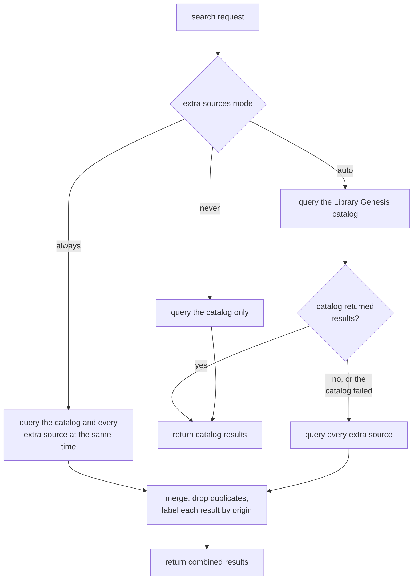
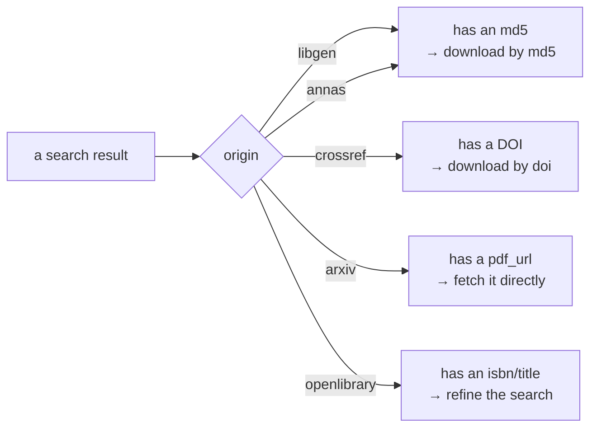

# How search works

A `search` asks one question, but it does not always ask it of only one place. By default it
queries the **Library Genesis catalog** and stops there. When that catalog has nothing — or
fails outright — the search quietly reaches further, into Anna's Archive and the
open-access providers, so a miss is never reported as a dead end without having looked
further. This page explains that flow in plain terms: what a search does by default, when and
why it reaches beyond the catalog, and what comes back and how to act on it.

## The default: the Library Genesis catalog

An ordinary search asks the Library Genesis catalog and only the catalog. It sends no traffic
to any third party, because it does not need to: the catalog holds millions of books, papers,
comics, magazines, and standards, and it answers in a single fast round-trip. Whatever the
catalog returns — the result page, the match counts, the per-file metadata — is what you get
back.

This is the path almost every search takes. It stays fast, it stays predictable, and it
touches no one the search did not need to touch.

## Reaching beyond the catalog

Sometimes the catalog genuinely does not have what you are looking for — the item lives in a
collection the catalog never indexed, or a mirror outage made the catalog unreachable for that
call. Rather than hand back an empty result, the search can escalate and consult a set of
**extra sources**:

- [Anna's Archive](https://annas-archive.org/) — a shadow-library search engine that indexes
  collections the catalog reaches nowhere else (Z-Library, Nexus/STC, DuXiu, Internet
  Archive, and more). Its hits are keyed by file digest (an md5), so they behave just like
  catalog results.
- [arXiv](https://arxiv.org/), [Crossref](https://www.crossref.org/), and
  [OpenLibrary](https://openlibrary.org/) — open-access providers. Their hits are not
  md5-keyed, so they land in their own list, each carrying one actionable identifier: a DOI
  from Crossref, a direct `pdf_url` from arXiv, and an `isbn`/title from OpenLibrary.

When this escalation happens is controlled by a single three-valued setting — the
`extra_sources` argument on the call, falling back to the deployment's
`LIBGEN_MCP_EXTRA_SOURCES` default:

- **`auto` (the default).** Consult the extra sources only when the catalog returns nothing
  or fails outright. An ordinary search never pays for them; a miss triggers a rescue.
- **`always`.** Consult the extra sources on every search. Because this decision does not
  depend on what the catalog answers, the extra sources are queried *at the same time* as the
  catalog rather than after it, so a forced search costs one round of latency instead of two.
  Useful when you specifically want the widest net, at the cost of extra traffic on every call.
- **`never`.** Restrict every search to the catalog, even on a miss. As a deployment
  default (`LIBGEN_MCP_EXTRA_SOURCES=never`) this is a **lock, not a default**: a per-call
  `extra_sources` cannot re-enable the extras, because a policy an individual caller can
  overrule is not a policy. Searches still work — they simply never reach further.

The whole decision is small enough to draw:

When the extras are consulted, every source is queried and the answers are merged. Duplicates
are removed by **file digest** (the md5): the same file surfaced by two sources appears only
once. When that same file appears in both the catalog and Anna's, **the catalog record wins**,
because it carries richer metadata — publishers, languages, ISBNs, and the other fields the
catalog invests in collecting. The Anna's copy is dropped rather than shown twice in a
thinner form.

## What comes back: origins and downloads

Every result is labeled with an **`origin`** that says which searcher produced it. That label
is not decoration — it tells you which identifier the result carries, and therefore which
argument to hand to `download`:

- **`libgen`** and **`annas`** — the result carries an md5, plus the file's format and
  size, so the two can be compared. Download it with `download`'s `md5` argument.
- **`crossref`** — the result carries a DOI. Download it with `download`'s `doi` argument.
- **`arxiv`** — the result carries a direct `pdf_url`. Fetch that URL; `download` takes no
  arXiv identifier.
- **`openlibrary`** — the result carries an `isbn` and a title, and no file at all.
  OpenLibrary is a catalog, not a repository: use those to run a better-targeted `search`.

An Anna's hit also works with `get_details`: the catalog has no record for it, so the tool
falls back to Anna's own metadata and labels the record `origin: "annas"`. That record is
thinner than a catalog one, and most Anna's items publish no IPFS address — so a keyless
download may still not be possible even when the metadata is.

This split is why Anna's hits merge into the main results list alongside the catalog hits,
while the open-access hits appear in a separate list: the two groups are keyed differently,
and `download` reads the key to know where to fetch from. Treat the `origin` as the
instruction for the next step — it tells you exactly which argument to pass.

One distinction worth stating plainly: **Anna's Archive is not an open-access source.** It is
a shadow library, not a publisher of freely-licensed material, so it is listed separately from
the open-access providers (arXiv, Crossref, OpenLibrary). Do not infer anything about a
result's licensing from the fact that a search found it.

## Why it works this way

The two behaviors above are a deliberate trade-off:

- **An ordinary search stays fast and quiet.** Under `auto`, a search that the catalog answers
  never contacts a third party. There is no extra latency, no extra traffic, and no dependency
  on providers you did not need — the catalog answer is the answer.
- **A miss is never a dead end.** The moment the catalog comes up empty or fails, the search
  has already looked further. The same single call that would otherwise return "not found"
  instead returns what it found elsewhere, labeled so you know where each result came from
  and how to fetch it.

In short: the common path is cheap, and the fallback is automatic. You get speed when the
catalog has it, and reach when it does not.
