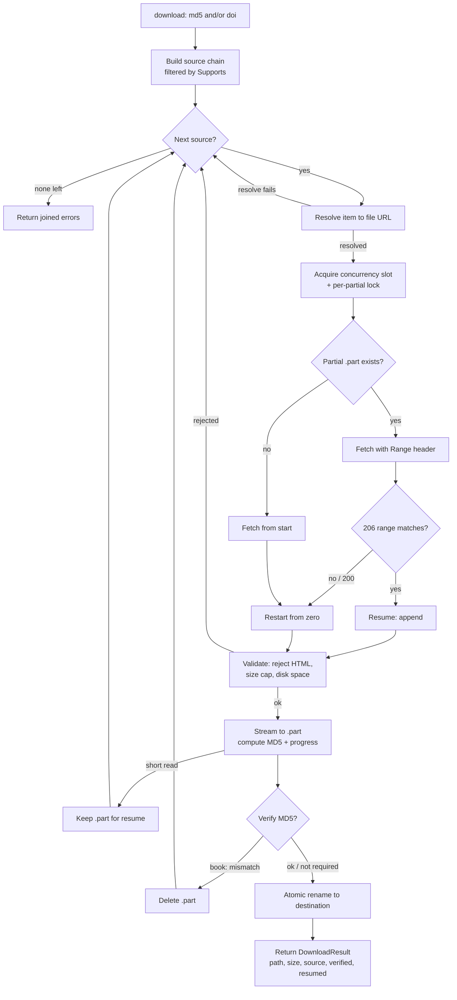

`libgen-mcp` is a thin MCP server around an HTTP client for the `libgen.li` mirror family, plus a set of pluggable download sources. This page describes the three pieces that do the work: the resilient **HTTP client** (mirror discovery, failover, retry, cooldown), the **download pipeline** (resolve → stream → resume → verify → atomic rename), and the **multi-source chain**.

## HTTP client

Page-level requests (`search`, `get_details`, and the LibGen link resolution used by downloads) go through a single client that makes the mirror family look like one reliable endpoint.

### Mirror discovery

Candidate mirrors are supplied by a `Manager`:

- The live list is fetched from the [shadowlibraries](https://shadowlibraries.github.io/DirectDownloads/libgen/) directory and cached for **24 hours** in the OS cache directory (`~/.cache/libgen-mcp/mirrors.json` on Linux, `~/Library/Caches/libgen-mcp/mirrors.json` on macOS).
- On startup the manager prefers, in order: a valid disk cache, a live fetch (which it then writes to cache), a stale cache, and finally a hardcoded fallback list. Only the fallback is not memoized, so the next request retries discovery instead of pinning to it.
- The preferred mirror (`libgen.li` by default, or `LIBGEN_MIRROR` when set) is always placed first. Setting `LIBGEN_MIRROR` pins that single mirror.
- A long-running server re-discovers once the in-memory list exceeds its 24-hour TTL, so it picks up mirror changes without a restart.

### Failover, retry, and cooldown

For each page request the client sweeps the candidate mirrors, preferred first, and classifies every failure:

- **Transient** (network error, timeout, HTTP 5xx, or 429): the mirror is put in a **45-second cooldown** and the request is retried on the next pass, up to `LIBGEN_MCP_RETRY_ATTEMPTS` passes, with a growing backoff (base 200 ms, doubling per attempt, capped at 30 s, plus jitter).
- **Permanent** (a 4xx other than 429, e.g. 404/403): the mirror is removed from the remaining passes and the request fails over to the next candidate immediately — no cooldown, no backoff.

When a mirror is in cooldown it is skipped; if every eligible mirror is cooling down, the full list is tried anyway (better than nothing). The outcome is distinguished so the caller can react correctly:

- `ErrAllMirrorsFailed` — at least one transient failure occurred: a genuine connectivity problem.
- `ErrRequestRejected` — every mirror returned a permanent error: a normal "not found / rejected", not a network alarm.

All outbound requests (page requests and file streams alike) pass through a shared token-bucket rate limiter sized by `LIBGEN_MCP_RATE_RPS` and `LIBGEN_MCP_RATE_BURST`.

## Download pipeline

Downloads use a separate HTTP client with **no global timeout** — long transfers are bounded by the request context, not a fixed deadline. Concurrency is capped by a semaphore of size `LIBGEN_MCP_MAX_CONCURRENT_DOWNLOADS`; extra downloads queue for a slot (and can be canceled while queued, before touching the network).

For a given item the pipeline:

1. **Resolves** the item against a source to a concrete, streamable URL (plus any headers, a verify-MD5 flag, and a fallback extension).
2. Computes a deterministic **partial (`.part`) path**, namespaced by source name and a key (the MD5 for books, or a hash of the DOI/URL otherwise), and takes a per-partial lock so two downloads of the same target never corrupt each other.
3. **Fetches** the file; if bytes are already on disk it sends a `Range` header to **resume** from that offset.
4. Inspects the response: a `206` whose `Content-Range` start matches the existing bytes resumes; a `200` restarts from zero; anything else is a failure.
5. **Validates** the response — rejects HTML error pages (by `Content-Type` and by sniffing the first 512 bytes), enforces the size cap against the full expected size, and checks free disk space.
6. **Streams** the body into the `.part` file while computing its MD5 and reporting throttled progress. On resume it re-hashes the bytes already on disk so the final digest covers the whole file.
7. **Verifies** (for MD5-keyed sources) the digest against the requested MD5. A mismatch or an oversized transfer deletes the partial; a transient short read keeps it so a later call can resume.
8. **Atomically renames** the completed `.part` to the final destination.

The chosen filename is, in priority order: an explicit `filename`, the CDN-announced `Content-Disposition` name, a clean `Author - Title (Year).ext` built from metadata, or the MD5 — always sanitized, with a source-provided extension appended when the name has none.

### Download flow

## Multi-source chain

Download sources implement a common interface — `Name`, `Supports(item)`, and `Resolve(ctx, item)` — so the shared pipeline stays provider-agnostic. The chain is built from configuration in the fixed order `unpaywall → scihub → libgen → randombook`, and each source is offered only the items it supports:

| Source       | Keyed by | Role                  | How it resolves                                                                                                                                     |
| ------------ | -------- | --------------------- | ------------------------------------------------------------------------------------------------------------------------------------------------- |
| `unpaywall`  | DOI      | Open-access articles  | Queries the Unpaywall API for a best open-access PDF link. Returns an error (advancing the chain) when the DOI is not OA or exposes no PDF.         |
| `scihub`     | DOI      | Article fallback      | Requests `https://<host>/<doi>` on each configured Sci-Hub host in turn, scraping the embedded PDF link from the first that serves an article page. |
| `libgen`     | MD5      | Primary book provider | Resolves the LibGen link chain (`ads.php` key → `get.php` → CDN) through the mirror failover client, and requires MD5 verification.                 |
| `randombook` | MD5      | Book fallback         | Queries the randombook.org API to discover fresh libgen-family mirror hostnames for the MD5, then runs the LibGen link chain against those hosts.   |

Because the chain is a single ordered slice filtered by `Supports`, a book item is offered `[libgen, randombook]`, an article item `[unpaywall, scihub]`, and an item carrying both is offered article sources first, then book sources. `LIBGEN_MCP_SOURCES` removes sources from this chain without reordering it. `Download` tries each supporting source in turn and returns the first success; if all fail, it returns the joined per-source errors.
