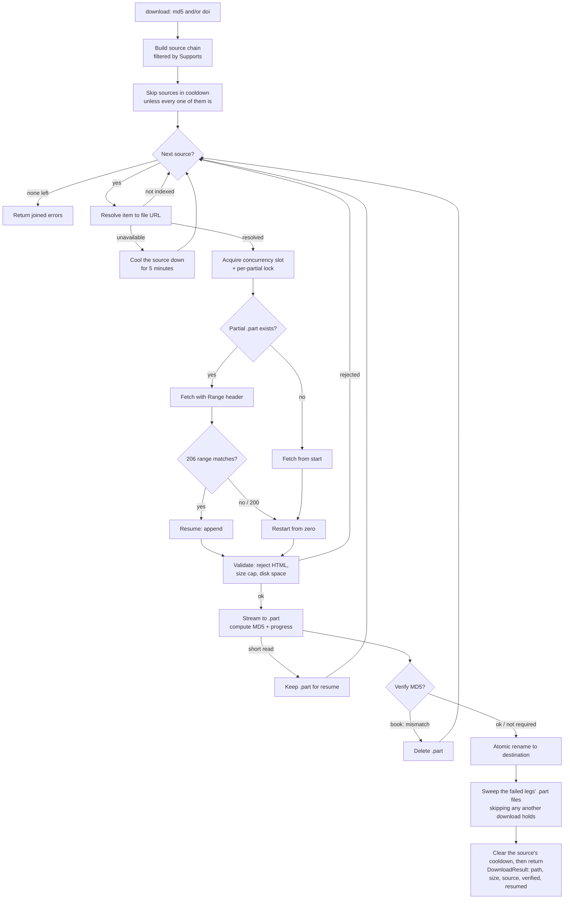

`libgen-mcp` is a thin MCP server around an HTTP client for the `libgen.li` mirror family, plus a set of pluggable download sources. Three pieces do the work: the resilient **HTTP client** (mirror discovery, failover, retry, cooldown), the **download pipeline** (resolve → stream → resume → verify → atomic rename), and the **multi-source chain** of twelve download providers tried in a fixed order.

## HTTP client

Page-level requests (`search`, `get_details`, and the LibGen link resolution used by downloads) go through a single client that makes the mirror family look like one reliable endpoint.

### Mirror discovery

Candidate mirrors are supplied by a `Manager`:

- The live list is fetched from the [shadowlibraries](https://shadowlibraries.github.io/DirectDownloads/libgen/) directory and cached for **24 hours** in the OS cache directory (`~/.cache/libgen-mcp/mirrors.json` on Linux, `~/Library/Caches/libgen-mcp/mirrors.json` on macOS).
- On startup the manager prefers, in order: a valid disk cache, a live fetch (which it then writes to cache), a stale cache, and finally a hardcoded fallback list. Only the fallback is not memoized, so the next request retries discovery instead of pinning to it.
- The preferred mirror (`libgen.li` by default, or `LIBGEN_MIRROR` when set) is always placed first. Setting `LIBGEN_MIRROR` pins that single mirror.
- A long-running server re-discovers once the in-memory list exceeds its 24-hour TTL, so it picks up mirror changes without a restart.

### Failover, retry, and cooldown

For each page request the client sweeps the candidate mirrors, preferred first, and classifies every failure:

- **Transient** (network error, timeout, HTTP 5xx, or 429): the mirror is put in a **45-second cooldown** and the request is retried on the next pass, up to `LIBGEN_MCP_RETRY_ATTEMPTS` passes, with a growing backoff (base 200 ms, doubling per attempt, capped at 30 s, plus jitter).
- **Permanent** (a 4xx other than 429, e.g. 404/403): the mirror is removed from the remaining passes and the request fails over to the next candidate immediately — no cooldown, no backoff.

When a mirror is in cooldown it is skipped; if every eligible mirror is cooling down, the full list is tried anyway (better than nothing). The outcome is distinguished so the caller can react correctly:

- `ErrAllMirrorsFailed` — at least one transient failure occurred: a genuine connectivity problem.
- `ErrRequestRejected` — every mirror returned a permanent error: a normal "not found / rejected", not a network alarm.

All outbound requests (page requests and file streams alike) pass through a shared token-bucket rate limiter sized by `LIBGEN_MCP_RATE_RPS` and `LIBGEN_MCP_RATE_BURST`.

## Download pipeline

Downloads use a separate HTTP client with **no global timeout** — long transfers are bounded by the request context and a progress-aware stall guard, not a fixed deadline. Concurrency is capped by a semaphore of size `LIBGEN_MCP_MAX_CONCURRENT_DOWNLOADS`; extra downloads queue for a slot (and can be canceled while queued, before touching the network).

### Start-retries and the stall guard

Two mechanisms make downloads resilient without ever cutting a healthy transfer:

- **Staged start-retries.** Getting a download to _begin_ — resolving a fresh URL, connecting, and pulling the first byte — is retried on a schedule (`LIBGEN_MCP_DOWNLOAD_START_RETRY_WAITS`, default `5s,5s,5s,10s,10s,10s,15s`: 8 attempts over ~60 s). A resolve error, connection error, non-2xx status, or a 2xx response that yields no bytes is retried; each retry resolves afresh so an expired key is renewed. The moment bytes flow, start-retries stop and streaming begins. This wraps a _single_ source attempt — the multi-source chain still advances to the next source when one is exhausted. When every source fails to start, the download returns an actionable error guiding the caller to retry now, retry later, or ask the user.
- **Progress-resetting stall timeout.** While streaming, a download is aborted only when **no** bytes arrive within `LIBGEN_MCP_DOWNLOAD_STALL_TIMEOUT` (default 60 s). Every received byte resets the window, so a slow-but-progressing transfer (20–50 kB/s is common) is never cut, while a truly dead connection is dropped after the window with its `.part` kept for resume. The per-request `LIBGEN_MCP_TIMEOUT` is never applied to a stream; caller (LLM) cancellation aborts promptly.

For a given item the pipeline:

1. **Resolves** the item against a source to a concrete, streamable URL (plus any headers, a verify-MD5 flag, and a fallback extension).
2. Computes a deterministic **partial (`.part`) path**, namespaced by source name and a key (the MD5 for books, or a hash of the DOI/URL otherwise), and takes a per-partial lock so two downloads of the same target never corrupt each other.
3. **Fetches** the file under the start-retry schedule (re-resolving on each attempt); if bytes are already on disk it sends a `Range` header to **resume** from that offset.
4. Inspects the response: a `206` whose `Content-Range` start matches the existing bytes resumes; a `200` restarts from zero; anything else is a failure.
5. **Validates** the response — rejects HTML error pages (by `Content-Type` and by sniffing the first 512 bytes), enforces the size cap against the full expected size, and checks free disk space.
6. **Streams** the body into the `.part` file while computing its MD5 and reporting throttled progress, under the progress-resetting stall guard. On resume it re-hashes the bytes already on disk so the final digest covers the whole file.
7. **Verifies** (for MD5-keyed sources) the digest against the requested MD5. A mismatch or an oversized transfer deletes the partial; a transient short read keeps it so a later call can resume.
8. **Atomically renames** the completed `.part` to the final destination, then **sweeps** the partials the failed legs of this call left behind: a partial is only worth keeping while the item is still unresolved, and once a source delivers the file the rest are litter in the caller's download directory. Each removal takes that path's lock and skips the partial when another download holds it, so a concurrent transfer is never unlinked from under.

The chosen filename is, in priority order: an explicit `filename`, the CDN-announced `Content-Disposition` name, a clean `Author - Title (Year).ext` built from metadata, or the MD5 — always sanitized, with a source-provided extension appended when the name has none.

### Download flow

```mermaid
flowchart TD
    A[download: md5 and/or doi] --> B[Build source chain<br/>filtered by Supports]
    B --> B2[Skip sources in cooldown<br/>unless every one of them is]
    B2 --> C{Next source?}
    C -- none left --> Z[Return joined errors]
    C -- yes --> D[Resolve item to file URL]
    D -- not indexed --> C
    D -- unavailable --> Y[Cool the source down<br/>for 5 minutes]
    Y --> C
    D -- resolved --> E[Acquire concurrency slot<br/>+ per-partial lock]
    E --> F{Partial .part exists?}
    F -- yes --> G[Fetch with Range header]
    F -- no --> H[Fetch from start]
    G --> I{206 range matches?}
    I -- yes --> J[Resume: append]
    I -- no / 200 --> K[Restart from zero]
    H --> K
    J --> L[Validate: reject HTML,<br/>size cap, disk space]
    K --> L
    L -- rejected --> C
    L -- ok --> M[Stream to .part<br/>compute MD5 + progress]
    M -- short read --> N[Keep .part for resume] --> C
    M --> O{Verify MD5?}
    O -- book: mismatch --> P[Delete .part] --> C
    O -- ok / not required --> Q[Atomic rename to destination]
    Q --> S[Sweep the failed legs' .part files<br/>skipping any another download holds]
    S --> R[Clear the source's cooldown, then return<br/>DownloadResult: path, size, source, verified, resumed]
```

In prose: `download` builds the source chain for the identifier it was given, skips any source in cooldown (unless all of them are), and tries each in turn. A source that cannot serve the item is skipped; one that fails is cooled down for five minutes. Once a source resolves a URL, the download takes a concurrency slot and a per-partial lock, resumes from an existing `.part` when the server honours the `Range` request and restarts from zero otherwise, then validates the response — rejecting HTML error pages, oversized files and insufficient disk — before streaming to `.part` while computing the MD5. A short read keeps the partial for a later resume. An md5 mismatch deletes it and moves to the next source. On success the file is atomically renamed into place, the partials left by the legs that failed first are removed, the source's cooldown is cleared, and the result reports path, size, source, `verified` and `resumed`.

## Multi-source chain

Download sources implement a common interface — `Name`, `Supports(item)`, and `Resolve(ctx, item)` — so the shared pipeline stays provider-agnostic. The chain is built from configuration in the fixed order `unpaywall → europepmc → biorxiv → rfc → nist → fatcat → core → oapen → archive → scihub → scidb → libgen → randombook → annas`, and each source is offered only the items it supports:

| Source       | Keyed by | Role                  | How it resolves                                                                                                                                                                                                                                                                                                                                                                                         |
| ------------ | -------- | --------------------- | ------------------------------------------------------------------------------------------------------------------------------------------------------------------------------------------------------------------------------------------------------------------------------------------------------------------------------------------------------------------------------------------------------- |
| `unpaywall`  | DOI      | Open-access articles  | Queries the Unpaywall API for a best open-access PDF link. Returns an error (advancing the chain) when the DOI is not OA or exposes no PDF. Disabled — and absent from the chain — unless `LIBGEN_MCP_UNPAYWALL_EMAIL` is set, since the API requires a contact email.                                                                                                                                  |
| `europepmc`  | DOI      | Open-access articles  | Maps the DOI to a PubMed Central record via the Europe PMC search API and fetches the PDF from the PMC render backend (falling back to the article render endpoint). Serves only DOIs whose open-access full text Europe PMC holds. Keyless.                                                                                                                                                            |
| `biorxiv`    | DOI      | Open-access preprints | Confirms a `10.1101` preprint (bioRxiv then medRxiv) via the details API and returns the latest version's `.full.pdf`. Claims only `10.1101` DOIs. Keyless.                                                                                                                                                                                                                                             |
| `rfc`        | DOI      | Internet standards    | Builds the RFC Editor's plain-text URL from the RFC number in a `10.17487` DOI. Resolves without a request of its own, since the URL follows from the DOI. Text rather than PDF because the RFC Editor's PDF coverage is irregular while `.txt` exists for every RFC. Claims only `10.17487` DOIs. Keyless.                                                                                             |
| `nist`       | DOI      | NIST standards        | Hands the DOI resolver the `10.6028` DOI and lets the pipeline follow the redirect, which ends at the PDF in NIST's own repository (`nvlpubs.nist.gov`). Covers the SP 800-series, FIPS, IR, TN, CSWP and the Journal of Research. No series→path table or year lookup is needed. Claims only `10.6028` DOIs. Keyless.                                                                                  |
| `fatcat`     | DOI      | Open-access articles  | Looks the DOI up on Internet Archive Scholar (`scholar.archive.org/fatcat/release/lookup`), follows the redirect to the release page, and takes the preserved full-text URLs it advertises in its `citation_pdf_url` meta tags. Each candidate is liveness-probed before the chain commits, since a preserved capture can go bad while the catalog still lists it. Keyless.                             |
| `core`       | DOI      | Open-access articles  | Looks the DOI up in CORE's v3 API (Bearer-authenticated) and returns the work's download URL only when CORE hosts a live copy — the URL is liveness-probed first, since CORE's links go stale often. Opt-in: absent from the chain unless `LIBGEN_MCP_CORE_KEY` is set. The key is sent only to `api.core.ac.uk`.                                                                                       |
| `oapen`      | DOI/ISBN | Open-access books     | Submits the identifier to OAPEN's DSpace REST search, fetches the candidate record with its bitstreams and metadata, and serves its ORIGINAL-bundle PDF only after the record's own `oapen.identifier.doi`/`.isbn` confirms the identifier — OAPEN's search is free text, so an unheld identifier still returns unrelated monographs. The bitstream is probed before it is returned. Keyless.           |
| `archive`    | ISBN     | Public-domain books   | Asks OpenLibrary which Internet Archive scans hold the ISBN, then confirms each candidate with `archive.org/metadata`. Serves a scan only when OpenLibrary reports `ebook_access: public` **and** the item carries no `access-restricted-item` flag and no lending collection, so a controlled-digital-lending copy (which advertises ordinary files but serves a DRM-wrapped one) is skipped. Keyless. |
| `scihub`     | DOI      | Article fallback      | Requests `https://<host>/<doi>` on each configured Sci-Hub host in turn, scraping the embedded PDF link from the first that serves an article page.                                                                                                                                                                                                                                                     |
| `scidb`      | DOI      | Article fallback      | Resolves the DOI through Anna's Archive SciDB viewer and takes the embedded PDF URL. Covers papers published after Sci-Hub stopped indexing.                                                                                                                                                                                                                                                            |
| `libgen`     | MD5      | Primary book provider | Resolves the LibGen link chain (`ads.php` key → `get.php` → CDN) through the mirror failover client, and requires MD5 verification.                                                                                                                                                                                                                                                                     |
| `randombook` | MD5      | Book fallback         | Queries the randombook.org API to discover fresh libgen-family mirror hostnames for the MD5, then runs the LibGen link chain against those hosts.                                                                                                                                                                                                                                                       |
| `annas`      | MD5      | Book fallback         | Resolves the md5 through Anna's Archive: reads the item's IPFS CID from the book page and streams from the first public gateway that serves it. With `LIBGEN_MCP_ANNAS_KEY` set, tries the member fast-download API first and keeps IPFS as the fallback.                                                                                                                                               |

Because the chain is a single ordered slice filtered by `Supports`, an md5-keyed book item is offered `[libgen, randombook, annas]`, an ISBN-keyed one `[oapen, archive]`, an article item `[unpaywall, europepmc, biorxiv, rfc, nist, fatcat, core, oapen, scihub, scidb]`, and an item carrying both an md5 and a DOI is offered article sources first, then book sources. `LIBGEN_MCP_SOURCES` removes sources from this chain without reordering it. `Download` tries each supporting source in turn and returns the first success; if all fail, it returns the joined per-source errors.

### Per-source cooldown

A source that fails because it is **unavailable** — a transport error, a timeout, a 5xx or a 429 — is set aside for 5 minutes, so the next download does not spend its resolve budget on a provider that just proved unreachable. This is the source-level counterpart of the per-mirror cooldown in the HTTP client, and it matters most for a service that is down for hours at a time: without it, every article download pays the full per-source budget for that provider again and again.

A source that answers correctly that it does **not hold the item** — not indexed, not open access, no preserved copy — is never set aside: that is a normal, correct answer about one item and says nothing about the provider's health. The two cases are told apart by the error taxonomy each source tags its failures with (`ErrSourceUnavailable` vs `ErrNotIndexed`).

Two rules bound the behavior:

- A cooldown only deprioritizes. When **every** source able to serve an item is in cooldown, the chain tries them all anyway — better to try than nothing — and says so in the log. An explicit `source:` argument therefore always reaches the source it names.
- A success lifts it. A source that just served a file is not unavailable, so serving one clears its cooldown.
- Nothing is persisted. The state lives on the client for the life of the process, so a restart starts clean.

Both decisions are visible in the log alongside the existing per-source attempt lines: a skipped source is reported at `INFO` with the instant its cooldown expires, and an all-cooled-down bypass at `WARN`.

## Search path

The download chain above is one of two federations in the server. The other is the search path, which is structured differently: the download chain is ordered and stops at the first success, while the searchers run concurrently and their answers are merged.

A search always queries the Library Genesis catalog through the same failover client. Whether it also queries the **extra searchers** — Anna's Archive plus the keyless open-access providers (arXiv, Crossref, OpenLibrary), the bibliographic indexes (dblp, PubMed) and ERIC — is decided by `ExtraSourcesMode`, resolved per call from the `extra_sources` argument and falling back to `LIBGEN_MCP_EXTRA_SOURCES`:

| Mode     | When the extras run                            | Scheduling                                                              |
| -------- | ---------------------------------------------- | ----------------------------------------------------------------------- |
| `auto`   | Only when the catalog returns nothing or fails | After the catalog, since the decision depends on the catalog's answer   |
| `always` | Every search                                   | Concurrently with the catalog, since the decision does not depend on it |
| `never`  | Never                                          | —                                                                       |

Each extra searcher implements `discovery.Provider` (`Name`, `Search`), and `Federate` runs the set concurrently with per-provider panic recovery, so one failing provider cannot fail the search. The merge is keyed by identifier space: Anna's hits carry an md5 and join `results` labeled `origin: "annas"`, while the open-access hits carry a DOI and stay in `open_access`. Duplicates are dropped by md5, and a file present in both the catalog and Anna's keeps the catalog record, which carries the richer metadata.

ERIC is a searcher with no matching download source, and deliberately so. Its contribution is education grey literature — reports, dissertations, agency documents — which carries no DOI, so it fits neither key space the download chain understands. It needs neither: ERIC serves every full text it holds from a URL derived from the record's accession number, so a hit arrives with its `pdf_url` already filled in and there is nothing for a `Resolve` to resolve. Adding an ERIC identifier to `Item`, `download` and `read` would have widened three schemas to wrap a string concatenation.

`get_details` follows the same split. An md5 the catalog has no record for — which is what an escalated search returns — falls back to Anna's own record page, parsed by label rather than by position because the field set varies by source collection.

For the conceptual walk-through with diagrams, see [How search works](/libgen-mcp/how-search-works/).

## Transports

The server speaks MCP over one of two transports, selected at startup:

- **stdio (default).** With no `--http` flag the server runs over stdio, reading requests on stdin and writing responses on stdout (logs go to stderr). This is the mode MCP clients such as Claude Code, Claude Desktop, Cursor, and VS Code use: the client launches the binary as a child process and speaks to it locally, one client per process.
- **streamable HTTP (opt-in).** Started with `--http host:port` (for example `libgen-mcp --http :8080`), the server instead serves the streamable HTTP transport, suitable for running centrally and connecting remote HTTP-capable clients. In this mode it also mounts a `GET /health` readiness endpoint that returns `200` (body `ok`) while the server is serving — handy for container and load-balancer health checks.

Both transports share the same tools, HTTP client, and download pipeline; only the request/response channel differs. Termination signals (SIGINT/SIGTERM) drain in-flight work and shut the active transport down gracefully. Because a `--http` server runs elsewhere and cannot write to the client's disk, it flips `download` into remote download mode: every call returns a link (a `resource_link` plus a `resolved` object) instead of saving a file. See [Tools](/libgen-mcp/tools/#where-the-file-goes-local-vs-remote) for details.

## Frequently asked questions

### How does libgen-mcp find a working Library Genesis mirror?

It discovers them rather than hard-coding one. The server probes the known mirror hosts, keeps the ones that answer, and caches that list on disk for 24 hours under the OS cache directory, so a restart does not re-probe. A mirror that fails is put in a 45-second cooldown and the next one in the list is used, which is why a single mirror going down is invisible to a caller. Setting `LIBGEN_MIRROR` pins one host and skips discovery entirely.

### What does libgen-mcp cache, and where?

Two things, both on the machine running the server and neither containing anything about you. The discovered mirror lists are cached for 24 hours as `mirrors.json` and `annas-mirrors.json` under the OS cache directory — they hold public mirror URLs only. The `read` tool keeps a temporary copy of each document it extracts text from, so successive pages of one document reuse a single fetch; those files are evicted on a size cap and a TTL, both configurable. Deleting either cache only forces a fresh fetch on the next call.

### Why does a download sometimes take a minute to start?

Because getting a transfer to begin is retried on a staged schedule before it is given up on. The default waits are `5s,5s,5s,10s,10s,10s,15s` — eight attempts over roughly a minute — and they are spent on resolving, connecting and receiving the first byte. Once bytes are flowing a different rule applies: the stream is cut only after 60 seconds with no new data, so a slow but progressing transfer is never killed for being slow.

### Can a deployment change the order the download sources are tried in?

No. `LIBGEN_MCP_SOURCES` can remove sources from the chain, but the order is fixed in code and pinned by a test, so the open-access providers are always tried before the shadow-library fallbacks. A deployment can narrow what participates; it cannot promote a fallback.
