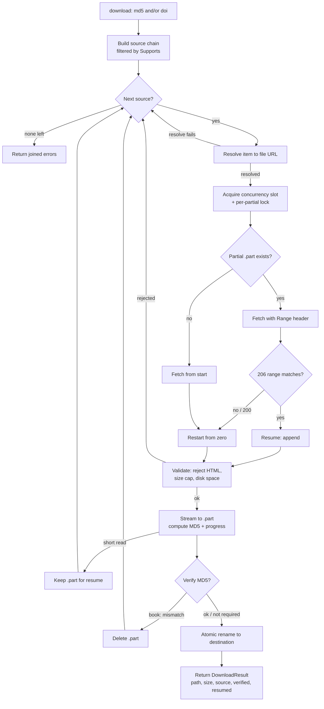

`libgen-mcp` es un servidor MCP ligero en torno a un cliente HTTP para la familia de mirrors `libgen.li`, más un conjunto de fuentes de descarga conectables. Esta página describe las tres piezas que hacen el trabajo: el **cliente HTTP** resiliente (descubrimiento de mirrors, failover, reintentos, enfriamiento), la **canalización de descarga** (resolver → transmitir → reanudar → verificar → renombrado atómico) y la **cadena multi-fuente**.

## Cliente HTTP

Las peticiones a nivel de página (`search`, `get_details` y la resolución de enlaces de LibGen que usan las descargas) pasan por un único cliente que hace que la familia de mirrors parezca un solo endpoint fiable.

### Descubrimiento de mirrors

Un `Manager` suministra los mirrors candidatos:

- La lista viva se obtiene del directorio de [shadowlibraries](https://shadowlibraries.github.io/DirectDownloads/libgen/) y se cachea durante **24 horas** en el directorio de caché del SO (`~/.cache/libgen-mcp/mirrors.json` en Linux, `~/Library/Caches/libgen-mcp/mirrors.json` en macOS).
- Al arrancar, el manager prefiere, en orden: una caché de disco válida, una obtención en vivo (que luego escribe en caché), una caché obsoleta y, finalmente, una lista de reserva codificada. Solo la reserva no se memoiza, de modo que la siguiente petición reintenta el descubrimiento en vez de anclarse a ella.
- El mirror preferido (`libgen.li` por defecto, o `LIBGEN_MIRROR` cuando se define) se coloca siempre primero. Fijar `LIBGEN_MIRROR` ancla ese único mirror.
- Un servidor de larga vida vuelve a descubrir en cuanto la lista en memoria supera su TTL de 24 horas, de modo que capta los cambios de mirrors sin reiniciar.

### Failover, reintentos y enfriamiento

Para cada petición de página, el cliente recorre los mirrors candidatos, el preferido primero, y clasifica cada fallo:

- **Transitorio** (error de red, timeout, HTTP 5xx o 429): el mirror se pone en un **enfriamiento de 45 segundos** y la petición se reintenta en la siguiente pasada, hasta `LIBGEN_MCP_RETRY_ATTEMPTS` pasadas, con un backoff creciente (base 200 ms, duplicándose por intento, con tope en 30 s, más jitter).
- **Permanente** (un 4xx distinto de 429, p. ej. 404/403): el mirror se retira de las pasadas restantes y la petición hace failover al siguiente candidato de inmediato — sin enfriamiento, sin backoff.

Cuando un mirror está en enfriamiento se omite; si todos los mirrors elegibles están enfriándose, se prueba toda la lista de todos modos (mejor que nada). El resultado se distingue para que el llamante pueda reaccionar correctamente:

- `ErrAllMirrorsFailed` — ocurrió al menos un fallo transitorio: un problema de conectividad genuino.
- `ErrRequestRejected` — todos los mirrors devolvieron un error permanente: un "no encontrado / rechazado" normal, no una alarma de red.

Todas las peticiones salientes (peticiones de página y flujos de archivo por igual) pasan por un limitador de tasa token-bucket compartido, dimensionado por `LIBGEN_MCP_RATE_RPS` y `LIBGEN_MCP_RATE_BURST`.

## Canalización de descarga

Las descargas usan un cliente HTTP aparte **sin timeout global** — las transferencias largas están acotadas por el contexto de la petición y por un guardián de estancamiento consciente del progreso, no por un plazo fijo. La concurrencia está limitada por un semáforo de tamaño `LIBGEN_MCP_MAX_CONCURRENT_DOWNLOADS`; las descargas extra hacen cola por un hueco (y pueden cancelarse mientras están en cola, antes de tocar la red).

### Reintentos de inicio y el guardián de estancamiento

Dos mecanismos hacen que las descargas sean resilientes sin cortar nunca una transferencia sana:

- **Reintentos de inicio escalonados.** Conseguir que una descarga _empiece_ — resolver una URL nueva, conectar y obtener el primer byte — se reintenta con un programa (`LIBGEN_MCP_DOWNLOAD_START_RETRY_WAITS`, por defecto `5s,5s,5s,10s,10s,10s,15s`: 8 intentos en ~60 s). Un error de resolución, de conexión, un estado no 2xx, o una respuesta 2xx que no entrega bytes se reintenta; cada reintento resuelve de nuevo, de modo que una clave caducada se renueva. En cuanto fluyen bytes, los reintentos de inicio se detienen y comienza el streaming. Esto envuelve el intento de una _sola_ fuente — la cadena multifuente sigue avanzando a la siguiente fuente cuando una se agota. Cuando todas las fuentes fallan al iniciar, la descarga devuelve un error accionable que guía a quien llama a reintentar ahora, reintentar más tarde o preguntar al usuario.
- **Timeout de estancamiento que se reinicia con el progreso.** Durante el streaming, una descarga se aborta solo cuando **no** llega ningún byte dentro de `LIBGEN_MCP_DOWNLOAD_STALL_TIMEOUT` (por defecto 60 s). Cada byte recibido reinicia la ventana, así que una transferencia lenta pero que progresa (20–50 kB/s es habitual) nunca se corta, mientras que una conexión realmente muerta se descarta tras la ventana conservando su `.part` para reanudar. El `LIBGEN_MCP_TIMEOUT` por petición nunca se aplica a un stream; la cancelación de quien llama (el LLM) aborta de inmediato.

Para un elemento dado, la canalización:

1. **Resuelve** el elemento contra una fuente a una URL concreta y transmisible (más cualquier cabecera, un flag de verificación MD5 y una extensión de reserva).
2. Calcula una **ruta parcial (`.part`)** determinista, con espacio de nombres por el nombre de la fuente y una clave (el MD5 para libros, o un hash del DOI/URL en otro caso), y toma un lock por parcial para que dos descargas del mismo objetivo nunca se corrompan entre sí.
3. **Obtiene** el archivo bajo el programa de reintentos de inicio (resolviendo de nuevo en cada intento); si ya hay bytes en disco, envía una cabecera `Range` para **reanudar** desde ese offset.
4. Inspecciona la respuesta: un `206` cuyo inicio de `Content-Range` coincide con los bytes existentes reanuda; un `200` reinicia desde cero; cualquier otra cosa es un fallo.
5. **Valida** la respuesta — rechaza páginas HTML de error (por `Content-Type` e inspeccionando los primeros 512 bytes), aplica el límite de tamaño contra el tamaño total esperado y comprueba el espacio libre en disco.
6. **Transmite** el cuerpo al archivo `.part` mientras calcula su MD5 e informa el progreso de forma regulada, bajo el guardián de estancamiento que se reinicia con el progreso. En reanudación, vuelve a calcular el hash de los bytes ya en disco para que el digest final cubra todo el archivo.
7. **Verifica** (para fuentes con clave MD5) el digest contra el MD5 solicitado. Una discrepancia o una transferencia sobredimensionada elimina el parcial; una lectura corta transitoria lo conserva para que una llamada posterior pueda reanudar.
8. **Renombra atómicamente** el `.part` completado a su destino final.

El nombre de archivo elegido es, por orden de prioridad: un `filename` explícito, el nombre `Content-Disposition` anunciado por el CDN, un `Author - Title (Year).ext` limpio construido a partir de los metadatos, o el MD5 — siempre saneado, con una extensión aportada por la fuente añadida cuando el nombre no tiene ninguna.

### Flujo de descarga

## Cadena multi-fuente

Las fuentes de descarga implementan una interfaz común — `Name`, `Supports(item)` y `Resolve(ctx, item)` — de modo que la canalización compartida permanece agnóstica del proveedor. La cadena se construye desde la configuración en el orden fijo `unpaywall → scihub → libgen → randombook`, y a cada fuente solo se le ofrecen los elementos que admite:

| Fuente       | Con clave | Rol                           | Cómo resuelve                                                                                                                                                              |
| ------------ | --------- | ----------------------------- | -------------------------------------------------------------------------------------------------------------------------------------------------------------------------- |
| `unpaywall`  | DOI       | Artículos de acceso abierto   | Consulta la API de Unpaywall en busca del mejor enlace a PDF de acceso abierto. Devuelve un error (avanzando la cadena) cuando el DOI no es OA o no expone PDF.            |
| `scihub`     | DOI       | Reserva de artículos          | Solicita `https://<host>/<doi>` en cada host de Sci-Hub configurado por turno, extrayendo el enlace al PDF incrustado del primero que sirva una página de artículo.        |
| `libgen`     | MD5       | Proveedor principal de libros | Resuelve la cadena de enlaces de LibGen (`ads.php` clave → `get.php` → CDN) a través del cliente de failover de mirrors, y exige verificación MD5.                         |
| `randombook` | MD5       | Reserva de libros             | Consulta la API de randombook.org para descubrir nombres de host frescos de la familia libgen para el MD5, luego ejecuta la cadena de enlaces de LibGen contra esos hosts. |

Como la cadena es un único slice ordenado filtrado por `Supports`, a un elemento libro se le ofrece `[libgen, randombook]`, a uno artículo `[unpaywall, scihub]`, y a uno que lleva ambos se le ofrecen primero las fuentes de artículo, luego las de libro. `LIBGEN_MCP_SOURCES` elimina fuentes de esta cadena sin reordenarla. `Download` prueba cada fuente compatible por turno y devuelve el primer éxito; si todas fallan, devuelve los errores por fuente unidos.

## Transportes

El servidor habla MCP sobre dos transportes:

- **stdio por defecto** — cómo lo lanzan clientes como Claude Code, Claude Desktop, Cursor o VS Code. Sin argumentos adicionales, el proceso sirve por stdio (stdout se reserva para el protocolo; los logs van a stderr).
- **HTTP en streaming** — cuando se inicia con `--http host:port` (p. ej. `--http :8080`). En este modo el servidor expone además un endpoint `GET /health` que devuelve `200` cuando está sirviendo, útil para sondas de disponibilidad.
