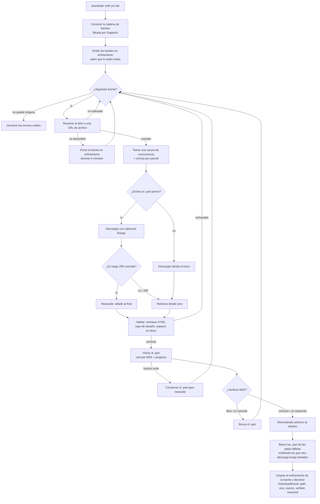

`libgen-mcp` federa un conjunto de catálogos bibliográficos y proveedores de acceso abierto tras cuatro herramientas MCP. Por debajo es un servidor ligero en torno a un cliente HTTP para la familia de mirrors `libgen.li` del catálogo primario, más un conjunto de fuentes de descarga conectables. Tres piezas hacen el trabajo: el **cliente HTTP** resiliente (descubrimiento de mirrors, failover, reintentos, enfriamiento), la **canalización de descarga** (resolver → transmitir → reanudar → verificar → renombrado atómico) y la **cadena multi-fuente** de veinte proveedores de descarga probados en un orden fijo.

## Cliente HTTP

Las peticiones a nivel de página (`search`, `get_details` y la resolución de enlaces de LibGen que usan las descargas) pasan por un único cliente que hace que la familia de mirrors parezca un solo endpoint fiable.

### Política de direcciones salientes

Casi todas las URL que descarga este servidor las eligió otro: el enlace a texto completo que una editorial depositó en Crossref, la URL de descarga de un repositorio que republican Unpaywall, OpenAlex o CORE, un `citation_pdf_url` raspado de la página de una editorial. Nada en esa cadena impide que una de esas URL nombre la interfaz de loopback, la LAN del operador o un endpoint de metadatos de la nube — y si lo hiciera, el servidor estaría actuando como proxy hacia una red que quien depositó la URL jamás podría alcanzar por su cuenta. Eso es server-side request forgery, y `internal/netguard` es donde se rechaza.

La comprobación vive en el hook `Control` del dialer y no sobre la URL, porque solo el dialer ve a qué resolvió realmente el nombre. Una comprobación a nivel de URL la derrota un host público con un registro `A` privado, y también el DNS rebinding; al hook `Control` se le entrega la IP concreta microsegundos antes del `connect`. Se bloquean: loopback, `0.0.0.0/8`, la dirección de difusión IPv4, link-local unicast y multicast (`169.254.0.0/16`, que contiene `169.254.169.254`, y `fe80::/10`), todos los ámbitos multicast, el espacio privado de RFC 1918 y RFC 4193, y el NAT de operador de RFC 6598 — cada uno también en su disfraz IPv4-mapped sobre IPv6.

Como la política se instala en el `Transport` compartido, la heredan de golpe todas las fuentes de descarga, todos los sondeos de disponibilidad, todos los proveedores de discovery y todas las consultas de mirrors, en lugar de tener que acordarse cada una. Una política de redirects complementaria acota la cadena en cinco saltos y elimina `Authorization` y `Cookie` siempre que un redirect cambie de host — que es la única protección que el dialer no puede dar, ya que `net/http` conserva esas cabeceras para cualquier _subdominio_ del original.

`LIBGEN_MCP_ALLOW_PRIVATE_ADDRESSES=true` la levanta, para el único caso legítimo: un operador que ejecuta su propio mirror en su propia red. Está desactivado por defecto y se aplica a todas las fuentes a la vez, en ambos sentidos.

### Descubrimiento de mirrors

Un `Manager` suministra los mirrors candidatos:

- La lista viva se obtiene del directorio de [shadowlibraries](https://shadowlibraries.github.io/DirectDownloads/libgen/) y se cachea durante **24 horas** en el directorio de caché del SO (`~/.cache/libgen-mcp/mirrors.json` en Linux, `~/Library/Caches/libgen-mcp/mirrors.json` en macOS).
- Al arrancar, el manager prefiere, en orden: una caché de disco válida, una obtención en vivo (que luego escribe en caché), una caché obsoleta y, finalmente, una lista de reserva codificada. Solo la reserva no se memoiza, de modo que la siguiente petición reintenta el descubrimiento en vez de anclarse a ella.
- El mirror preferido (`libgen.li` por defecto, o `LIBGEN_MIRROR` cuando se define) se coloca siempre primero. Definir `LIBGEN_MIRROR` mueve ese host al frente; el descubrimiento se sigue ejecutando y el resto de la lista queda disponible para el failover.
- Un servidor de larga vida vuelve a descubrir en cuanto la lista en memoria supera su TTL de 24 horas, de modo que capta los cambios de mirrors sin reiniciar.

### Failover, reintentos y enfriamiento

Para cada petición de página, el cliente recorre los mirrors candidatos, el preferido primero, y clasifica cada fallo:

- **Transitorio** (error de red, timeout, HTTP 5xx o 429): el mirror se pone en un **enfriamiento de 45 segundos** y la petición se reintenta en la siguiente pasada, hasta `LIBGEN_MCP_RETRY_ATTEMPTS` pasadas, con un backoff creciente (base 200 ms, duplicándose por intento, con tope en 30 s, más jitter).
- **Permanente** (un 4xx distinto de 429, p. ej. 404/403): el mirror se retira de las pasadas restantes y la petición hace failover al siguiente candidato de inmediato — sin enfriamiento, sin backoff.

Cuando un mirror está en enfriamiento se omite; si todos los mirrors elegibles están enfriándose, se prueba toda la lista de todos modos (mejor que nada). El resultado se distingue para que el llamante pueda reaccionar correctamente:

- `ErrAllMirrorsFailed` — ocurrió al menos un fallo transitorio: un problema de conectividad genuino.
- `ErrRequestRejected` — todos los mirrors devolvieron un error permanente: un "no encontrado / rechazado" normal, no una alarma de red.

Todas las peticiones salientes (peticiones de página y flujos de archivo por igual) pasan por un limitador de tasa token-bucket compartido, dimensionado por `LIBGEN_MCP_RATE_RPS` y `LIBGEN_MCP_RATE_BURST`.

## Canalización de descarga

Las descargas usan un cliente HTTP aparte **sin timeout global** — las transferencias largas están acotadas por el contexto de la petición y por un guardián de estancamiento consciente del progreso, no por un plazo fijo. La concurrencia está limitada por un semáforo de tamaño `LIBGEN_MCP_MAX_CONCURRENT_DOWNLOADS`; las descargas extra hacen cola por un hueco (y pueden cancelarse mientras están en cola, antes de tocar la red).

### Reintentos de inicio y el guardián de estancamiento

Dos mecanismos hacen que las descargas sean resilientes sin cortar nunca una transferencia sana:

- **Reintentos de inicio escalonados.** Conseguir que una descarga _empiece_ — resolver una URL nueva, conectar y obtener el primer byte — se reintenta con un programa (`LIBGEN_MCP_DOWNLOAD_START_RETRY_WAITS`, por defecto `5s,5s,5s,10s,10s,10s,15s`: 8 intentos en ~60 s). Un error de resolución, de conexión, un estado no 2xx, o una respuesta 2xx que no entrega bytes se reintenta; cada reintento resuelve de nuevo, de modo que una clave caducada se renueva. En cuanto fluyen bytes, los reintentos de inicio se detienen y comienza el streaming. Esto envuelve el intento de una _sola_ fuente — la cadena multifuente sigue avanzando a la siguiente fuente cuando una se agota. Cuando todas las fuentes fallan al iniciar, la descarga devuelve un error accionable que guía a quien llama a reintentar ahora, reintentar más tarde o preguntar al usuario.
- **Timeout de estancamiento que se reinicia con el progreso.** Durante el streaming, una descarga se aborta solo cuando **no** llega ningún byte dentro de `LIBGEN_MCP_DOWNLOAD_STALL_TIMEOUT` (por defecto 60 s). Cada byte recibido reinicia la ventana, así que una transferencia lenta pero que progresa (20–50 kB/s es habitual) nunca se corta, mientras que una conexión realmente muerta se descarta tras la ventana conservando su `.part` para reanudar. El `LIBGEN_MCP_TIMEOUT` por petición nunca se aplica a un stream; la cancelación de quien llama (el LLM) aborta de inmediato.

Para un elemento dado, la canalización:

1. **Resuelve** el elemento contra una fuente a una URL concreta y transmisible (más cualquier cabecera, un flag de verificación MD5 y una extensión de reserva).
2. Calcula una **ruta parcial (`.part`)** determinista, con espacio de nombres por el nombre de la fuente y una clave (el MD5 para libros, o un hash del DOI/URL en otro caso), y toma un lock por parcial para que dos descargas del mismo objetivo nunca se corrompan entre sí.
3. **Obtiene** el archivo bajo el programa de reintentos de inicio (resolviendo de nuevo en cada intento); si ya hay bytes en disco, envía una cabecera `Range` para **reanudar** desde ese offset.
4. Inspecciona la respuesta: un `206` cuyo inicio de `Content-Range` coincide con los bytes existentes reanuda; un `200` reinicia desde cero; cualquier otra cosa es un fallo.
5. **Valida** la respuesta — rechaza páginas HTML de error (por `Content-Type` e inspeccionando los primeros 512 bytes), aplica el límite de tamaño contra el tamaño total esperado y comprueba el espacio libre en disco.
6. **Transmite** el cuerpo al archivo `.part` mientras calcula su MD5 e informa el progreso de forma regulada, bajo el guardián de estancamiento que se reinicia con el progreso. En reanudación, vuelve a calcular el hash de los bytes ya en disco para que el digest final cubra todo el archivo.
7. **Verifica** (para fuentes con clave MD5) el digest contra el MD5 solicitado. Una discrepancia o una transferencia sobredimensionada elimina el parcial; una lectura corta transitoria lo conserva para que una llamada posterior pueda reanudar.
8. **Renombra atómicamente** el `.part` completado a su destino final y, después, **barre** los parciales que las patas fallidas de esta llamada dejaron atrás: un parcial solo merece conservarse mientras el ítem sigue sin resolver, y en cuanto una fuente entrega el archivo el resto son basura en el directorio de descargas de quien llama. Cada borrado toma el cerrojo de esa ruta y omite el parcial si otra descarga lo tiene tomado, para no desvincular un archivo que otra transferencia está escribiendo.

El nombre de archivo elegido es, por orden de prioridad: un `filename` explícito, el nombre `Content-Disposition` anunciado por el CDN, un `Author - Title (Year).ext` limpio construido a partir de los metadatos, o el MD5 — siempre saneado, con una extensión aportada por la fuente añadida cuando el nombre no tiene ninguna.

### Flujo de descarga

```mermaid
flowchart TD
    A[download: md5 y/o doi] --> B[Construir la cadena de fuentes<br/>filtrada por Supports]
    B --> B2[Omitir las fuentes en enfriamiento<br/>salvo que lo estén todas]
    B2 --> C{¿Siguiente fuente?}
    C -- no queda ninguna --> Z[Devolver los errores unidos]
    C -- sí --> D[Resolver el ítem a una URL de archivo]
    D -- no indexado --> C
    D -- no disponible --> Y[Poner la fuente en enfriamiento<br/>durante 5 minutos]
    Y --> C
    D -- resuelto --> E[Tomar una ranura de concurrencia<br/>+ cerrojo por parcial]
    E --> F{¿Existe un .part previo?}
    F -- sí --> G[Descargar con cabecera Range]
    F -- no --> H[Descargar desde el inicio]
    G --> I{¿El rango 206 coincide?}
    I -- sí --> J[Reanudar: añadir al final]
    I -- no / 200 --> K[Reiniciar desde cero]
    H --> K
    J --> L[Validar: rechazar HTML,<br/>tope de tamaño, espacio en disco]
    K --> L
    L -- rechazado --> C
    L -- correcto --> M[Volcar al .part<br/>calcular MD5 + progreso]
    M -- lectura corta --> N[Conservar el .part para reanudar] --> C
    M --> O{¿Verificar MD5?}
    O -- libro: no coincide --> P[Borrar el .part] --> C
    O -- correcto / no requerido --> Q[Renombrado atómico al destino]
    Q --> S[Barrer los .part de las patas fallidas<br/>omitiendo los que otra descarga tenga tomados]
    S --> R[Limpiar el enfriamiento de la fuente y devolver<br/>DownloadResult: path, size, source, verified, resumed]
```

En prosa: `download` construye la cadena de fuentes para el identificador recibido, salta las que estén en enfriamiento (salvo que lo estén todas) y prueba cada una por turno. Una fuente que no puede servir el ítem se omite; una que falla se enfría cinco minutos. Cuando una fuente resuelve una URL, la descarga toma un hueco de concurrencia y un cerrojo por parcial, reanuda desde un `.part` existente si el servidor respeta la petición `Range` y reinicia desde cero si no, y valida la respuesta — rechazando páginas HTML de error, ficheros que exceden el tope y disco insuficiente — antes de transmitir a `.part` calculando el MD5. Una lectura corta conserva el parcial para reanudar más tarde. Una discrepancia de MD5 lo borra y pasa a la siguiente fuente. Al terminar, el fichero se renombra atómicamente a su destino, se eliminan los parciales que dejaron las patas que fallaron antes, se limpia el enfriamiento de la fuente y el resultado informa de path, size, source, `verified` y `resumed`.

## Cadena multi-fuente

Las fuentes de descarga implementan una interfaz común — `Name`, `Supports(item)` y `Resolve(ctx, item)` — de modo que la canalización compartida permanece agnóstica del proveedor. La cadena se construye desde la configuración en el orden fijo `unpaywall → openalex → europepmc → biorxiv → rfc → nist → dagstuhl → acl → zenodo → scielo → fao → fatcat → core → crossref → oapen → archive → scihub → scidb → libgen → randombook → annas`, y a cada fuente solo se le ofrecen los elementos que admite:

| Fuente       | Identificado por               | Rol                             | En una línea                                                                                             |
| ------------ | ------------------------------ | ------------------------------- | -------------------------------------------------------------------------------------------------------- |
| `unpaywall`  | DOI                            | Artículos de acceso abierto     | El mejor enlace a PDF de acceso abierto que la API de Unpaywall conoce para un DOI.                      |
| `openalex`   | DOI                            | Artículos de acceso abierto     | El mismo índice de acceso abierto que Unpaywall, alcanzado sin credencial alguna.                        |
| `europepmc`  | DOI                            | Artículos de acceso abierto     | El texto completo de acceso abierto de PubMed Central, vía la API de Europe PMC.                         |
| `biorxiv`    | DOI `10.1101`                  | Preprints de acceso abierto     | El `.full.pdf` de la última versión en bioRxiv o medRxiv.                                                |
| `rfc`        | DOI `10.17487`                 | Estándares de internet          | El `.txt` canónico del RFC Editor, construido a partir del número de RFC.                                |
| `nist`       | DOI `10.6028`                  | Normas del NIST                 | La redirección del resolutor de DOI, que acaba en el PDF de `nvlpubs.nist.gov`.                          |
| `dagstuhl`   | DOI `10.4230`                  | Actas de acceso abierto         | LIPIcs, OASIcs, DARTS y los Dagstuhl Reports, desde la página de documento de DROPS.                     |
| `acl`        | DOI `10.18653/v1`/`10.3115/v1` | Actas de acceso abierto         | `aclanthology.org/<id>.pdf`, construido con el identificador que el DOI ya contiene.                     |
| `zenodo`     | DOI `10.5281/zenodo`           | Depósitos de acceso abierto     | El mejor fichero del registro, listado por la única ruta `/api` que permite robots.txt.                  |
| `scielo`     | DOI `10.1590`                  | Artículos de acceso abierto     | El PDF propio de SciELO Brasil, tomado de la página del artículo a la que resuelve el DOI.               |
| `fao`        | DOI `10.4060`                  | Documentos de agencia de la ONU | El bitstream del ítem en el FAO Knowledge Repository, por el único endpoint REST que permite robots.txt. |
| `fatcat`     | DOI                            | Texto completo preservado       | Las copias preservadas de Internet Archive Scholar, sondeadas antes de usarlas.                          |
| `core`       | DOI                            | Artículos de acceso abierto     | La URL de descarga de CORE, devuelta solo cuando aún sirve una copia viva.                               |
| `crossref`   | DOI                            | Depositado por la editorial     | El enlace a texto completo que la editorial depositó en Crossref, comprobado antes de usarlo.            |
| `oapen`      | DOI/ISBN                       | Libros de acceso abierto        | Una monografía con licencia abierta, tras confirmar el identificador en el registro.                     |
| `archive`    | ISBN                           | Libros de dominio público       | Un escaneo de Internet Archive, solo si es público y no está restringido por préstamo.                   |
| `scihub`     | DOI                            | Reserva de artículos            | El PDF que incrusta el primer mirror de Sci-Hub que sirva una página de artículo.                        |
| `scidb`      | DOI                            | Reserva de artículos            | El PDF incrustado en el visor SciDB de Anna's Archive.                                                   |
| `libgen`     | MD5                            | Proveedor principal de libros   | La cadena de enlaces de LibGen (`ads.php` → `get.php` → CDN), con verificación MD5.                      |
| `randombook` | MD5                            | Reserva de libros               | Mirrors frescos de la familia libgen descubiertos por la API de randombook.org.                          |
| `annas`      | MD5                            | Reserva de libros               | Anna's Archive por pasarelas IPFS públicas, o la API de miembros si hay clave.                           |

Dos de ellas están apagadas por defecto: `unpaywall` necesita `LIBGEN_MCP_UNPAYWALL_EMAIL` y `core` necesita `LIBGEN_MCP_CORE_KEY`, y sin ellas un despliegue sin configurar no las tiene en la cadena en absoluto. Para saber qué alcanza cada fuente, cómo resuelve un identificador, las trampas medidas en ella y las reglas de rastreo que respeta, ver [Fuentes de descarga](/libgen-mcp/es/sources/) — esta tabla es solo el índice.

Como la cadena es un único slice ordenado filtrado por `Supports`, a un libro identificado por md5 se le ofrece `[libgen, randombook, annas]`, a uno identificado por ISBN `[oapen, archive]`, a un artículo `[unpaywall, openalex, europepmc, biorxiv, rfc, nist, dagstuhl, acl, zenodo, scielo, fao, fatcat, core, crossref, oapen, scihub, scidb]`, y a uno que lleva md5 y DOI se le ofrecen primero las fuentes de artículo, luego las de libro. `LIBGEN_MCP_SOURCES` elimina fuentes de esta cadena sin reordenarla. `Download` prueba cada fuente compatible por turno y devuelve el primer éxito; si todas fallan, devuelve los errores por fuente unidos.

### Enfriamiento por fuente

Una fuente que falla porque está **no disponible** — un error de transporte, un timeout, un 5xx o un 429 — se aparta durante 5 minutos, de modo que la siguiente descarga no gaste su presupuesto de resolución en un proveedor que acaba de demostrar ser inalcanzable. Es el equivalente a nivel de fuente del enfriamiento por mirror del cliente HTTP, y donde más importa es en un servicio caído durante horas: sin él, cada descarga de artículo paga otra vez el presupuesto completo de esa fuente.

Una fuente que responde correctamente que **no tiene el elemento** — no indexado, sin acceso abierto, sin copia preservada — nunca se aparta: es una respuesta normal y correcta sobre un elemento y no dice nada sobre la salud del proveedor. Ambos casos se distinguen por la taxonomía de errores con la que cada fuente etiqueta sus fallos (`ErrSourceUnavailable` frente a `ErrNotIndexed`).

Dos reglas acotan el comportamiento:

- Un enfriamiento solo baja la prioridad, nunca deshabilita. Cuando **todas** las fuentes capaces de servir un elemento están en enfriamiento, la cadena las prueba igualmente — mejor intentarlo que nada — y lo indica en el log. Por eso un argumento `source:` explícito siempre llega a la fuente que nombra.
- Un éxito lo levanta. Una fuente que acaba de servir un archivo no está no disponible, así que servir uno borra su enfriamiento.
- Nada se persiste. El estado vive en el cliente durante la vida del proceso, así que un reinicio empieza limpio.

Ambas decisiones son visibles en el log junto a las líneas de intento por fuente ya existentes: una fuente omitida se registra en `INFO` con el instante en que expira su enfriamiento, y el caso de todas en enfriamiento en `WARN`.

## Camino de búsqueda

La cadena de descarga anterior es una de las dos federaciones del servidor. La otra es el camino de búsqueda, con una estructura distinta: la cadena de descarga está ordenada y se detiene en el primer éxito, mientras que los buscadores se ejecutan en paralelo y sus respuestas se fusionan.

Una búsqueda siempre consulta el catálogo de Library Genesis a través del mismo cliente con failover. Que consulte además los **buscadores adicionales** — Anna's Archive más los proveedores de acceso abierto sin clave (arXiv, Crossref, OpenLibrary), los índices bibliográficos (dblp, PubMed) y ERIC — lo decide `ExtraSourcesMode`, resuelto en cada llamada a partir del argumento `extra_sources` y con `LIBGEN_MCP_EXTRA_SOURCES` como respaldo:

| Modo     | Cuándo se ejecutan los adicionales               | Planificación                                                    |
| -------- | ------------------------------------------------ | ---------------------------------------------------------------- |
| `auto`   | Solo cuando el catálogo no devuelve nada o falla | Después del catálogo, porque la decisión depende de su respuesta |
| `always` | En cada búsqueda                                 | A la vez que el catálogo, porque la decisión no depende de él    |
| `never`  | Nunca                                            | —                                                                |

Cada buscador adicional implementa `discovery.Provider` (`Name`, `Search`), y `Federate` ejecuta el conjunto en paralelo con recuperación de pánico por proveedor, así que un proveedor que falle no puede tumbar la búsqueda. La fusión se hace por espacio de identificadores: los resultados de Anna's llevan md5 y se unen a `results` etiquetados con `origin: "annas"`, mientras que los de acceso abierto llevan DOI y se quedan en `open_access`. Los duplicados se eliminan por md5, y un archivo presente tanto en el catálogo como en Anna's conserva el registro del catálogo, que lleva metadatos más ricos.

ERIC es un buscador sin fuente de descarga asociada, y a propósito. Lo que aporta es literatura gris educativa — informes, tesis, documentos de agencias — que no lleva DOI, así que no encaja en ninguno de los dos espacios de identificadores que entiende la cadena de descarga. Tampoco lo necesita: ERIC sirve todo texto completo que aloja desde una URL derivada del número de registro, de modo que un resultado llega con su `pdf_url` ya rellenado y no queda nada que un `Resolve` deba resolver. Añadir un identificador de ERIC a `Item`, `download` y `read` habría ampliado tres esquemas para envolver una concatenación de cadenas.

`get_details` sigue la misma división. Un md5 del que el catálogo no tiene registro — que es justo lo que devuelve una búsqueda escalada — recurre a la propia página de registro de Anna's, analizada por etiqueta y no por posición, porque el juego de campos varía según la colección de origen.

Para el recorrido conceptual con diagramas, ver [Cómo funciona la búsqueda](/libgen-mcp/es/how-search-works/).

## Transportes

El servidor habla MCP sobre dos transportes:

- **stdio por defecto** — cómo lo lanzan clientes como Claude Code, Claude Desktop, Cursor o VS Code. Sin argumentos adicionales, el proceso sirve por stdio (stdout se reserva para el protocolo; los logs van a stderr).
- **HTTP en streaming** — cuando se inicia con `--http host:port` (p. ej. `--http :8080`). En este modo el servidor expone además un endpoint `GET /health` que devuelve `200` cuando está sirviendo, útil para sondas de disponibilidad.

Como un servidor HTTP es remoto y no puede escribir en el disco del cliente, en este modo la herramienta `download` devuelve siempre un enlace (la URL directa como `resource_link` más un objeto `resolved`) en lugar de guardar el archivo — no hace falta pasar `resolve_only`, queda implícito. Consulta [Herramientas](/libgen-mcp/es/tools/#download) para el detalle de ese comportamiento.

### Modo sin estado

El transporte HTTP es **sin estado por defecto** ([SEP-2567](https://github.com/modelcontextprotocol/modelcontextprotocol/pull/2567)): el servidor ni lee ni escribe `Mcp-Session-Id`, cada POST es una petición completa atendida por una sesión temporal, y `GET`/`DELETE` sobre el endpoint MCP responden `405 Method Not Allowed` con `Allow: POST`. `GET /health` es una ruta aparte y no se ve afectada. El modo sin estado es lo que la versión `2026-07-28` del protocolo MCP exige sobre HTTP; el transporte con sesiones negocia `2025-11-25` o anterior.

Encaja con este servidor: no hay autenticación ni estado por cliente, así que un único servidor MCP compartido atiende todas las peticiones y una sesión no aportaba nada. Sin sesiones, además, cualquier número de réplicas puede ponerse detrás de un balanceador round-robin normal, sin enrutado pegajoso.

| Opción                     | Por defecto | Qué hace                                                                                                                                                                                       |
| -------------------------- | ----------- | ---------------------------------------------------------------------------------------------------------------------------------------------------------------------------------------------- |
| `--stateless`              | `true`      | Sirve HTTP en streaming sin sesiones. `--stateless=false` restaura el transporte con sesiones anterior, y los clientes pasan a negociar el protocolo `2025-11-25` o anterior.                  |
| `--json-response`          | `false`     | Devuelve cuerpos `application/json` en lugar de `text/event-stream` (SSE).                                                                                                                     |
| `--max-request-body-bytes` | `0`         | Limita el cuerpo de la petición en bytes; una petición que lo supere recibe `413`. `0` usa el valor por defecto del SDK, 4 MiB. Un valor negativo se rechaza al arrancar — quitaría el límite. |

**Cancelación de peticiones.** Un cliente que se desconecta a mitad de una llamada cancela el contexto del handler, de modo que una descarga de mirror abandonada se detiene en lugar de completarse. El SDK solo lo aplica a peticiones del protocolo `2026-07-28`, así que los clientes antiguos no se ven afectados.

**Pistas de caché.** `tools/list`, `prompts/list` y `server/discover` llevan una pista [SEP-2549](https://github.com/modelcontextprotocol/modelcontextprotocol/pull/2549) de `ttlMs: 3600000` (una hora) con el `cacheScope: "public"` por defecto. El catálogo va compilado en el binario y es idéntico para todos los clientes — sin autenticación y sin filtrado por cliente — así que un intermediario compartido también puede cachearlo.

**Elicitación.** Una sesión sin estado parte de los parámetros de inicialización por defecto, así que a un cliente **antiguo** no se le reconoce soporte de elicitación y la pregunta de confirmación de descarga cae a su valor determinista por defecto. Los clientes del protocolo `2026-07-28` usan el flujo de pregunta/respuesta MRTR que viaja en el propio resultado de la herramienta, que no necesita sesión y sigue funcionando. Sirve con `--stateless=false` si necesitas conservar el camino de elicitación antiguo para clientes antiguos.

**Sin enrutado por cabecera de parámetro.** Los argumentos de las herramientas viajan solo en el cuerpo JSON-RPC: nada de esta superficie lleva una anotación `x-mcp-header` de [SEP-2243](https://github.com/modelcontextprotocol/modelcontextprotocol/pull/2243). Anotar `md5` es el candidato evidente y se ha descartado a propósito — la anotación obliga al cliente a reflejar el valor en una cabecera `Mcp-Param-Md5` y al servidor a rechazar la llamada si falta, algo que los clientes de navegador no pueden cumplir por construcción, porque las cabeceras de nombre dinámico no se pueden incluir en la lista blanca de CORS con credenciales. Delante de este servidor no hay nada que fuera a enrutar con eso, así que el intercambio es todo coste.

## Preguntas frecuentes

### ¿Cómo encuentra libgen-mcp un mirror de Library Genesis que funcione?

Los descubre, en lugar de fijar uno en el código. El servidor descarga la lista de mirrors vigente de un directorio público de mirrors de bibliotecas en la sombra y la cachea en disco durante 24 horas bajo el directorio de caché del sistema, de modo que un reinicio reutiliza la lista cacheada en vez de volver a descargarla; si la descarga falla, recurre a una caché caducada y después a una lista integrada en el binario. Un mirror que falla entra en un enfriamiento de 45 segundos y se usa el siguiente de la lista, y por eso que un mirror concreto caiga es invisible para quien llama. Fijar `LIBGEN_MIRROR` coloca un host al frente de la lista descubierta; el descubrimiento se sigue ejecutando y los demás mirrors quedan disponibles para el failover.

### ¿Qué cachea libgen-mcp, y dónde?

Dos cosas, ambas en la máquina que ejecuta el servidor y ninguna con nada sobre ti. Las listas de mirrors descubiertos se cachean 24 horas como `mirrors.json` y `annas-mirrors.json` bajo el directorio de caché del sistema — contienen solo URLs públicas. La herramienta `read` guarda una copia temporal de cada documento del que extrae texto, para que páginas sucesivas de un mismo documento reutilicen una única descarga; esos ficheros se desalojan por límite de tamaño y por TTL, ambos configurables. Borrar cualquiera de las dos cachés solo fuerza una descarga nueva en la siguiente llamada.

### ¿Por qué a veces una descarga tarda un minuto en arrancar?

Porque conseguir que la transferencia empiece se reintenta con una tanda escalonada antes de darla por perdida. Las esperas por defecto son `5s,5s,5s,10s,10s,10s,15s` — ocho intentos en aproximadamente un minuto — y se gastan en resolver, conectar y recibir el primer byte. Una vez que los bytes fluyen se aplica otra regla: el flujo se corta solo tras 60 segundos sin datos nuevos, así que una transferencia lenta pero que progresa nunca se mata por ser lenta.

### ¿Puede un despliegue cambiar el orden en que se prueban las fuentes de descarga?

No. `LIBGEN_MCP_SOURCES` puede quitar fuentes de la cadena, pero el orden está fijado en el código y sujeto por un test, así que los proveedores de acceso abierto se prueban siempre antes que las alternativas de biblioteca en la sombra. Un despliegue puede estrechar qué participa; no puede promover un fallback.
