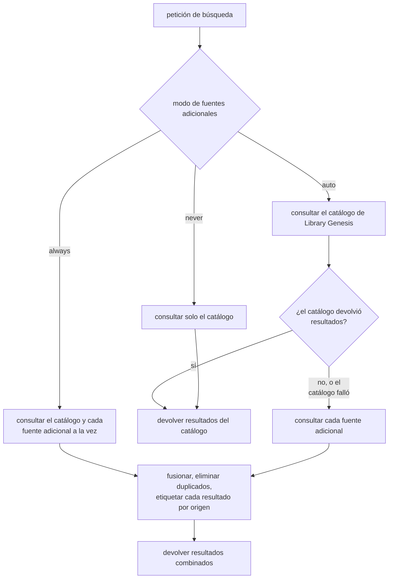
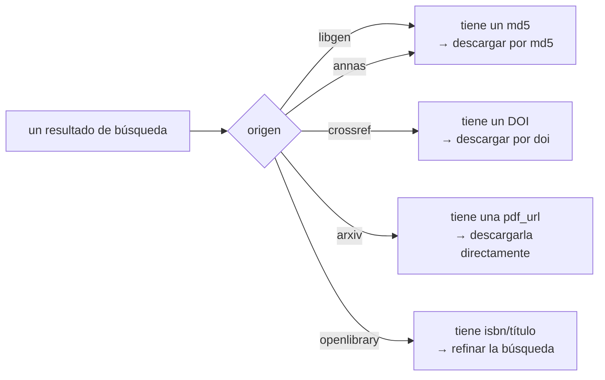

Una `search` hace una sola pregunta, pero no siempre se la hace a un único lugar. Por defecto consulta el **catálogo de Library Genesis** y ahí se queda. Cuando ese catálogo no tiene nada — o falla directamente — la búsqueda busca más allá, de forma silenciosa, en Anna's Archive y los proveedores de acceso abierto, de modo que un "no encontrado" nunca se reporta como callejón sin haber mirado más allá. Esta página explica ese flujo en términos llanos: qué hace una búsqueda por defecto, cuándo y por qué va más allá del catálogo, y qué devuelve y cómo actuar sobre ello.

## El comportamiento por defecto: el catálogo de Library Genesis

Una búsqueda ordinaria consulta el catálogo de Library Genesis y solo el catálogo. No envía tráfico a ningún tercero, porque no lo necesita: el catálogo alberga millones de libros, artículos, cómics, revistas y normas, y responde en una sola vuelta rápida. Lo que el catálogo devuelva — la página de resultados, los conteos de coincidencias, los metadatos de cada archivo — es lo que recibes.

Este es el camino que toma casi todas las búsquedas. Se mantiene rápida, se mantiene predecible y no toca a nadie que la búsqueda no necesitara tocar.

## Más allá del catálogo

A veces el catálogo genuinamente no tiene lo que buscas — el elemento vive en una colección que el catálogo nunca indexó, o una caída de mirror hizo que el catálogo no fuera accesible en esa llamada. En lugar de devolver un resultado vacío, la búsqueda puede escalar y consultar un conjunto de **fuentes adicionales**:

- [Anna's Archive](https://annas-archive.org/) — un motor de búsqueda de bibliotecas en la sombra que indexa colecciones que el catálogo no alcanza de ninguna otra forma (Z-Library, Nexus/STC, DuXiu, Internet Archive y más). Sus resultados se identifican por el digest del archivo (un md5), así que se comportan igual que los del catálogo.
- [arXiv](https://arxiv.org/), [Crossref](https://www.crossref.org/) y [OpenLibrary](https://openlibrary.org/) — proveedores de acceso abierto. Sus resultados no se identifican por md5, así que van a su propia lista, cada uno con un identificador accionable: un DOI en Crossref, una `pdf_url` directa en arXiv y un `isbn`/título en OpenLibrary.

Cuándo ocurre esta escalada lo controla un único ajuste de tres valores — el argumento `extra_sources` en la llamada, con el valor por defecto del despliegue `LIBGEN_MCP_EXTRA_SOURCES` como respaldo:

- **`auto` (por defecto).** Consultar las fuentes adicionales solo cuando el catálogo no devuelve nada o falla. Una búsqueda ordinaria nunca las paga; un fallo dispara un rescate.
- **`always`.** Consultar las fuentes adicionales en cada búsqueda. Como esta decisión no depende de lo que responda el catálogo, las fuentes adicionales se consultan _a la vez_ que el catálogo y no después, así que una búsqueda forzada cuesta una vuelta de latencia en lugar de dos. Útil cuando quieres específicamente la red más amplia, a costa de tráfico extra en cada llamada.
- **`never`.** Restringir cada búsqueda al catálogo, incluso ante un fallo. Existe para despliegues que, por razones de política, no deben contactar en absoluto con los proveedores adicionales.

La decisión entera es lo bastante pequeña para dibujarla:

Cuando se consultan las fuentes adicionales, se consulta a cada fuente y las respuestas se fusionan. Los duplicados se eliminan por **digest de archivo** (el md5): el mismo archivo que aparece en dos fuentes se muestra una sola vez. Cuando ese mismo archivo aparece tanto en el catálogo como en Anna's, **gana el registro del catálogo**, porque lleva metadatos más ricos — editoriales, idiomas, ISBNs y el resto de campos que el catálogo se esfuerza en recoger. La copia de Anna's se descarta en lugar de mostrarse dos veces en una forma más pobre.

## Qué vuelve: orígenes y descargas

Cada resultado se etiqueta con un **`origin`** (origen) que indica qué buscador lo produjo. Esa etiqueta no es decoración — indica qué identificador lleva el resultado y, por tanto, qué argumento pasar a `download`:

- **`libgen`** y **`annas`** — el resultado lleva un md5. Descárgalo con el argumento `md5` de `download`.
- **`crossref`** — el resultado lleva un DOI. Descárgalo con el argumento `doi` de `download`.
- **`arxiv`** — el resultado lleva una `pdf_url` directa. Descarga esa URL; `download` no acepta identificadores de arXiv.
- **`openlibrary`** — el resultado lleva un `isbn` y un título, y ningún archivo. OpenLibrary es un catálogo, no un repositorio: úsalos para lanzar una `search` mejor dirigida.

Un resultado de Anna's también sirve para `get_details`: el catálogo no tiene registro de él, así que la herramienta recurre a los metadatos propios de Anna's y etiqueta el registro con `origin: "annas"`. Ese registro es más pobre que uno del catálogo, y la mayoría de ítems de Anna's no publica dirección IPFS, así que puede que la descarga sin clave siga sin ser posible aunque los metadatos sí lo sean.

Esta división es la razón por la que los resultados de Anna's se fusionan en la lista principal junto a los del catálogo, mientras que los de acceso abierto aparecen en una lista aparte: los dos grupos se identifican de forma distinta, y `download` lee la clave para saber de dónde obtener el archivo. Considera el `origin` como la instrucción para el siguiente paso — te dice exactamente qué argumento pasar.

Una distinción que vale la pena afirmar con claridad: **Anna's Archive no es una fuente de acceso abierto.** Es una biblioteca en la sombra, no una editorial de material con licencia libre, así que se lista aparte de los proveedores de acceso abierto (arXiv, Crossref, OpenLibrary). No infieras nada sobre la licencia de un resultado del mero hecho de que una búsqueda lo haya encontrado.

## Por qué funciona así

Los dos comportamientos anteriores son un equilibrio deliberado:

- **Una búsqueda ordinaria se mantiene rápida y silenciosa.** Con `auto`, una búsqueda que el catálogo responde nunca contacta a un tercero. No hay latencia extra, no hay tráfico extra y no hay dependencia de proveedores que no necesitabas — la respuesta del catálogo es la respuesta.
- **Un fallo nunca es un callejón sin salida.** En el momento en que el catálogo sale vacío o falla, la búsqueda ya ha mirado más allá. La misma llamada única que de otro modo devolvería "no encontrado" devuelve en cambio lo que halló en otros sitios, etiquetado para que sepas de dónde vino cada resultado y cómo obtenerlo.

En resumen: el camino habitual es barato, y el respaldo es automático. Tienes velocidad cuando el catálogo la tiene, y alcance cuando no.
