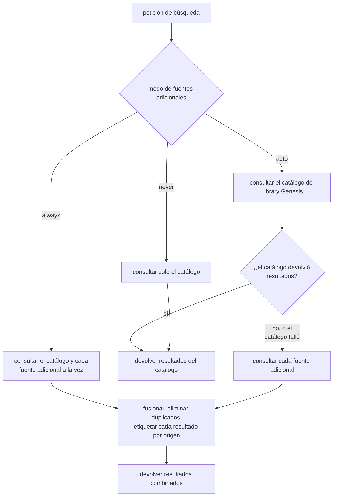
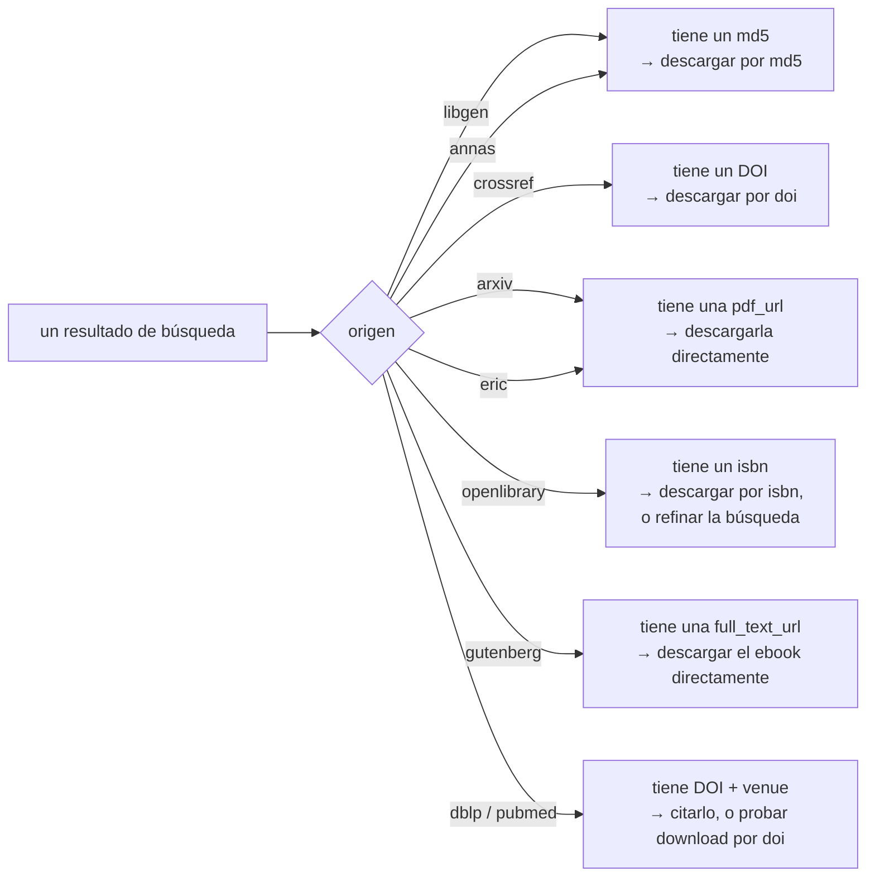

**libgen-mcp consulta primero el catálogo de Library Genesis y, por defecto, ahí se queda.** Cuando el catálogo no devuelve nada o falla directamente, la búsqueda escala a Anna's Archive y a otros siete proveedores — cinco repositorios de acceso abierto más los índices bibliográficos dblp y PubMed, de modo que un «no encontrado» nunca se reporta como callejón sin haber mirado más allá. Cuál de las dos cosas ocurre lo controla un único ajuste, `extra_sources`, con tres valores: `auto` (el predeterminado), `always` y `never`.

Esta página explica ese flujo: qué hace una búsqueda por defecto, cuándo y por qué va más allá del catálogo, y qué devuelve y cómo actuar sobre ello.

## El comportamiento por defecto: el catálogo de Library Genesis

Una búsqueda ordinaria consulta el catálogo de Library Genesis y solo el catálogo. No envía tráfico a ningún tercero, porque no lo necesita: el catálogo alberga millones de libros, artículos, cómics, revistas y normas, y responde en una sola vuelta rápida. Lo que el catálogo devuelva — la página de resultados, los conteos de coincidencias, los metadatos de cada archivo — es lo que recibes.

Solo-catálogo es el camino que toma casi toda búsqueda de `libgen-mcp`: una única ida y vuelta, sin tráfico a terceros y con un presupuesto de latencia predecible.

## Más allá del catálogo

A veces el catálogo genuinamente no tiene lo que buscas — el elemento vive en una colección que el catálogo nunca indexó, o una caída de mirror hizo que el catálogo no fuera accesible en esa llamada. En lugar de devolver un resultado vacío, la búsqueda puede escalar y consultar un conjunto de **fuentes adicionales**:

- [Anna's Archive](https://annas-archive.org/) — un motor de búsqueda de bibliotecas en la sombra que indexa colecciones que el catálogo no alcanza de ninguna otra forma (Z-Library, Nexus/STC, DuXiu, Internet Archive y más). Sus resultados se identifican por el digest del archivo (un md5), así que se comportan igual que los del catálogo.
- [arXiv](https://arxiv.org/), [Crossref](https://www.crossref.org/), [OpenLibrary](https://openlibrary.org/) y [Project Gutenberg](https://www.gutenberg.org/) (a través de la API de terceros [Gutendex](https://gutendex.com/)) — proveedores de acceso abierto. Sus resultados no se identifican por md5, así que van a su propia lista, cada uno con un identificador accionable: un DOI en Crossref, una `pdf_url` directa en arXiv, un `isbn` en OpenLibrary (pásalo a `download` para obtener una copia con licencia abierta, o úsalo para refinar una búsqueda del catálogo) y una `full_text_url` en Gutenberg — el propio fichero del ebook, ya que un texto de Gutenberg no tiene DOI, ISBN ni md5 con el que descargarlo. Solo se muestran los registros que Gutenberg declara libres de derechos; los que aloja con permiso del titular se descartan.
- [dblp](https://dblp.org/) y [PubMed](https://pubmed.ncbi.nlm.nih.gov/) — índices bibliográficos, de informática y biomedicina respectivamente. Responden _qué es el artículo_ (medio, año, lista completa de autores, DOI) sin afirmar que sea de lectura libre, y justo por eso vale la pena consultarlos: PubMed en particular cubre la literatura que no tiene ninguna copia en acceso abierto. Sus resultados van a la misma lista, nunca marcados como acceso abierto.
- [ERIC](https://eric.ed.gov/) — el índice de investigación educativa del Institute of Education Sciences de EE. UU., y la única fuente de esta lista que llega a la **literatura gris**: informes técnicos, tesis, ponencias de congreso y documentos gubernamentales o de agencias que no llevan DOI y por tanto no aparecen en ninguno de los proveedores anteriores. Un registro del que ERIC aloja un texto completo autorizado lleva un `pdf_url` descargable directamente y se marca como acceso abierto — son documentos de financiación pública servidos sin necesidad de cuenta. Un registro que solo indexa no lleva ninguna de las dos cosas, y es una entrada bibliográfica como una de dblp o PubMed.

Cuándo ocurre esta escalada lo controla un único ajuste de tres valores — el argumento `extra_sources` en la llamada, con el valor por defecto del despliegue `LIBGEN_MCP_EXTRA_SOURCES` como respaldo:

- **`auto` (por defecto).** Consultar las fuentes adicionales solo cuando el catálogo no devuelve nada o falla. Una búsqueda ordinaria nunca las paga; un fallo dispara un rescate.
- **`always`.** Consultar las fuentes adicionales en cada búsqueda. Como esta decisión no depende de lo que responda el catálogo, las fuentes adicionales se consultan _a la vez_ que el catálogo y no después, así que una búsqueda forzada cuesta una vuelta de latencia en lugar de dos. Útil cuando quieres específicamente la red más amplia, a costa de tráfico extra en cada llamada.
- **`never`.** Restringir cada búsqueda al catálogo, incluso ante un fallo. Como valor por defecto del despliegue (`LIBGEN_MCP_EXTRA_SOURCES=never`) esto es un **cierre, no un valor por defecto**: un `extra_sources` por llamada no puede reactivar las fuentes adicionales, porque una política que un cliente cualquiera puede saltarse no es una política. Las búsquedas siguen funcionando; simplemente no van más allá.

La decisión entera es lo bastante pequeña para dibujarla:

```mermaid
flowchart TD
    A[petición de búsqueda] --> B{modo de fuentes adicionales}
    B -->|never| N[consultar solo el catálogo]
    B -->|always| C[consultar el catálogo y cada<br/>fuente adicional a la vez]
    B -->|auto| D[consultar el catálogo de Library Genesis]
    D --> E{¿el catálogo devolvió<br/>resultados?}
    E -->|sí| F[devolver resultados del catálogo]
    E -->|no, o el<br/>catálogo falló| X[consultar cada fuente adicional]
    N --> F
    C --> G[fusionar, eliminar duplicados,<br/>etiquetar cada resultado por origen]
    X --> G
    G --> H[devolver resultados combinados]
```

En prosa: `never` consulta el catálogo de Library Genesis y se detiene ahí. `always` consulta el catálogo y todas las fuentes extra a la vez. `auto`, el valor por defecto, consulta primero el catálogo y solo recurre a las fuentes extra cuando este no devolvió nada o falló directamente. Siempre que se ejecutan las fuentes extra, sus resultados vuelven por dos canales: Anna's Archive se identifica por md5, así que sus ficheros se deduplican contra el catálogo y se unen a la lista principal `results`; los otros siete caen en un array aparte, `open_access`. Ambos se etiquetan por `origin`.

Cuando se consultan las fuentes adicionales, se consulta a cada fuente y las respuestas se fusionan. Los duplicados se eliminan por **digest de archivo** (el md5): el mismo archivo que aparece en dos fuentes se muestra una sola vez. Cuando ese mismo archivo aparece tanto en el catálogo como en Anna's, **gana el registro del catálogo**, porque lleva metadatos más ricos — editoriales, idiomas, ISBNs y el resto de campos que el catálogo se esfuerza en recoger. La copia de Anna's se descarta en lugar de mostrarse dos veces en una forma más pobre.

## Qué vuelve: orígenes y descargas

Cada resultado se etiqueta con un **`origin`** (origen) que indica qué buscador lo produjo. Esa etiqueta no es decoración — indica qué identificador lleva el resultado y, por tanto, qué argumento pasar a `download`:

- **`libgen`** y **`annas`** — el resultado lleva un md5, más el formato y el tamaño del fichero, de modo que ambos se pueden comparar. Descárgalo con el argumento `md5` de `download`.
- **`crossref`** — el resultado lleva un DOI. Descárgalo con el argumento `doi` de `download`.
- **`arxiv`** — el resultado lleva una `pdf_url` directa. Descarga esa URL; `download` no acepta identificadores de arXiv.
- **`openlibrary`** — el resultado lleva un `isbn` y un título. OpenLibrary es principalmente un catálogo, no un repositorio, así que úsalos para lanzar una `search` mejor dirigida — salvo que el libro sea de lectura pública, en cuyo caso también lleva un `archive_url` que puedes leer directamente en Internet Archive.
- **`dblp`** y **`pubmed`** — el resultado lleva un DOI y un `venue`, y no se afirma nada sobre su disponibilidad. Cítalo, o prueba el argumento `doi` de `download` sabiendo que puede no encontrar copia libre.
- **`eric`** — un resultado con `pdf_url` es un texto completo alojado: descarga esa URL, que para la literatura gris educativa es la única forma de obtener el archivo, ya que el registro no tiene DOI con el que `download` pueda operar. Un resultado sin ella es una entrada bibliográfica — cítala.

```mermaid
flowchart LR
    R[un resultado de búsqueda] --> O{origen}
    O -->|libgen| M[tiene un md5<br/>→ descargar por md5]
    O -->|annas| M
    O -->|crossref| P[tiene un DOI<br/>→ descargar por doi]
    O -->|arxiv| U[tiene una pdf_url<br/>→ descargarla directamente]
    O -->|openlibrary| S[tiene un isbn<br/>→ descargar por isbn,<br/>o refinar la búsqueda]
    O -->|eric| U
    O -->|gutenberg| G[tiene una full_text_url<br/>→ descargar el ebook directamente]
    O -->|dblp / pubmed| C[tiene DOI + venue<br/>→ citarlo, o probar download por doi]
```

En prosa: qué hacer con un resultado se deduce de su `origin`. Un resultado de `libgen` o `annas` lleva un md5 — descarga por md5. Uno de `crossref` lleva un DOI — descarga por doi. Uno de `arxiv` o `eric` lleva un `pdf_url` que obtienes directamente. Uno de `openlibrary` lleva un ISBN — descarga por isbn, o úsalo para afinar la búsqueda. Uno de `gutenberg` lleva un `full_text_url` con el propio ebook. Uno de `dblp` o `pubmed` es un registro bibliográfico con DOI y venue: cítalo, o prueba una descarga por doi.

Un resultado de Anna's también sirve para `get_details`: el catálogo no tiene registro de él, así que la herramienta recurre a los metadatos propios de Anna's y etiqueta el registro con `origin: "annas"`. Ese registro es más pobre que uno del catálogo, y la mayoría de ítems de Anna's no publica dirección IPFS, así que puede que la descarga sin clave siga sin ser posible aunque los metadatos sí lo sean.

Esta división es la razón por la que los resultados de Anna's se fusionan en la lista principal junto a los del catálogo, mientras que los de acceso abierto aparecen en una lista aparte: los dos grupos se identifican de forma distinta, y `download` lee la clave para saber de dónde obtener el archivo. Considera el `origin` como la instrucción para el siguiente paso — te dice exactamente qué argumento pasar.

Una distinción que vale la pena afirmar con claridad: **Anna's Archive no es una fuente de acceso abierto.** Es una biblioteca en la sombra, no una editorial de material con licencia libre, así que se lista aparte de los proveedores de acceso abierto (arXiv, Crossref, OpenLibrary). Tampoco los índices bibliográficos (dblp, PubMed) son fuentes de acceso abierto: indexan artículos con independencia de su licencia y no dicen nada sobre ella, así que sus resultados nunca se marcan como acceso abierto. ERIC es las dos cosas a la vez — aloja una parte de lo que indexa y del resto solo da la ficha — y por eso sus resultados se marcan como acceso abierto uno a uno y no en bloque. No infieras nada sobre la licencia de un resultado del mero hecho de que una búsqueda lo haya encontrado.

## Por qué funciona así

Consultar primero el catálogo y escalar solo al fallar son un equilibrio deliberado:

- **Una búsqueda ordinaria se mantiene rápida y silenciosa.** Con `auto`, una búsqueda que el catálogo responde nunca contacta a un tercero. No hay latencia extra, no hay tráfico extra y no hay dependencia de proveedores que no necesitabas — la respuesta del catálogo es la respuesta.
- **Un fallo nunca es un callejón sin salida.** En el momento en que el catálogo sale vacío o falla, la búsqueda ya ha mirado más allá. La misma llamada única que de otro modo devolvería "no encontrado" devuelve en cambio lo que halló en otros sitios, etiquetado para que sepas de dónde vino cada resultado y cómo obtenerlo.

**En modo `auto`, una búsqueda que el catálogo responde no contacta con ningún tercero**; solo un fallo o un error del catálogo desencadenan la escalada. Tienes velocidad cuando el catálogo la tiene, y alcance cuando no.

## Preguntas frecuentes

### ¿Cuándo busca libgen-mcp más allá del catálogo de Library Genesis?

Con la política `auto` predeterminada, solo cuando el catálogo no devuelve nada o falla directamente. Una búsqueda ordinaria que el catálogo responde no consulta ningún otro servicio. Fijar `extra_sources` a `always` consulta las fuentes adicionales en cada búsqueda, de forma concurrente con el catálogo y no después, porque esa decisión no depende de lo que el catálogo responda. Fijarlo a `never` restringe cada búsqueda al catálogo incluso ante un fallo, y como valor de despliegue es un cierre y no una preferencia: un argumento por llamada no puede volver a habilitar las fuentes adicionales.

### ¿Qué fuentes consulta una búsqueda más allá del catálogo?

Ocho: Anna's Archive y los siete proveedores de acceso abierto y bibliográficos arXiv, Crossref, OpenLibrary, Project Gutenberg, dblp, PubMed y ERIC. Los resultados de Anna's se identifican por md5 y se fusionan en la lista principal junto a los del catálogo; los demás se identifican por DOI, ISBN o una URL directa de fichero y caen en su propia lista. Cada resultado lleva una etiqueta `origin` que nombra al buscador que lo produjo, y es eso lo que te dice qué identificador pasar a `download`.

### ¿Cómo se tratan los resultados duplicados?

Se eliminan por huella del fichero. El mismo md5 aportado por dos fuentes aparece una sola vez. Cuando un fichero aparece a la vez en el catálogo y en Anna's Archive, gana el registro del catálogo, porque lleva metadatos más ricos — editoriales, idiomas, ISBN y los demás campos que el catálogo se molesta en recopilar — y la copia de Anna's se descarta en lugar de mostrarse dos veces en una forma más pobre.

### ¿Un resultado de búsqueda me dice si una obra es libre de leer?

Solo donde la fuente lo afirma. Anna's Archive es una biblioteca en la sombra y no una editorial de material con licencia libre, así que sus resultados nunca se marcan como acceso abierto. Los índices bibliográficos dblp y PubMed indexan artículos con independencia de su licencia y no dicen nada sobre ella, así que los suyos tampoco. ERIC es las dos cosas a la vez — aloja el texto completo autorizado de una parte de lo que indexa y del resto solo da la ficha — así que sus resultados se marcan uno a uno. No infieras la licencia de una obra del hecho de que una búsqueda la haya devuelto.
