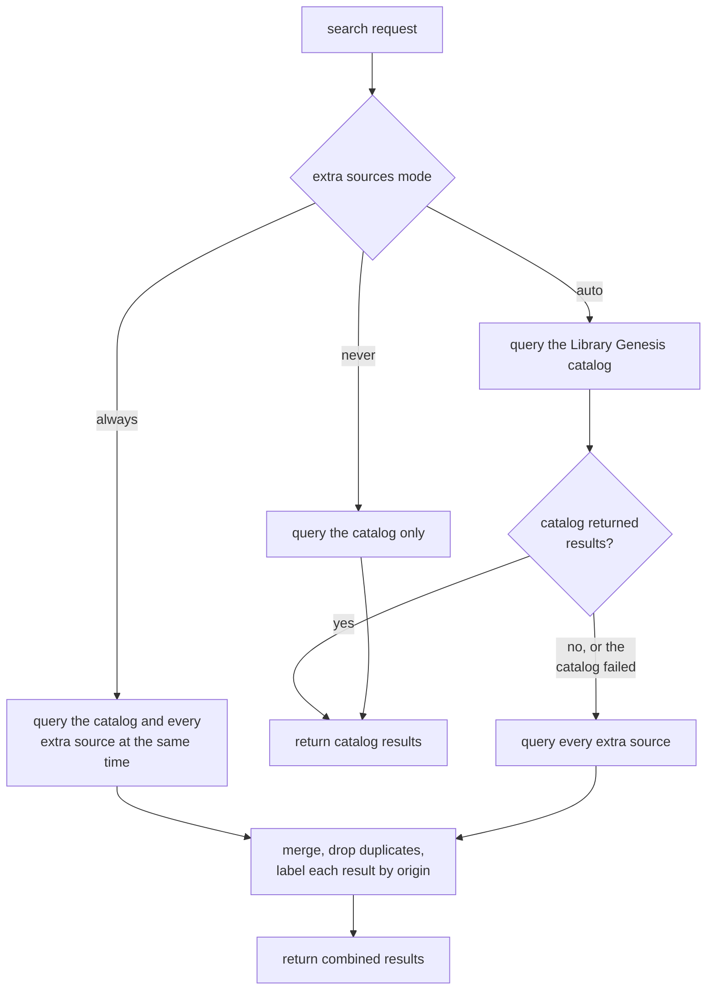
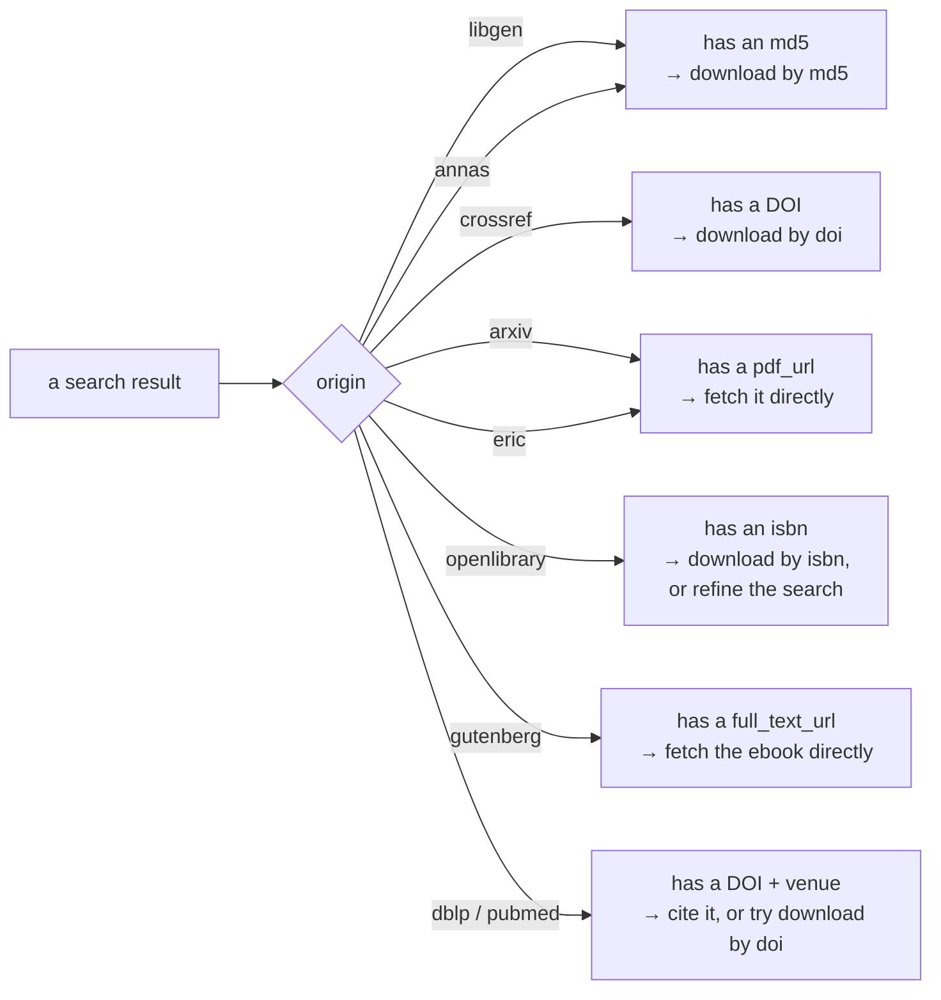

**libgen-mcp searches the Library Genesis catalog first and, by default, stops there.** When the catalog returns nothing or fails outright, the search escalates to Anna's Archive and eight open-access providers, so a miss is never reported as a dead end without having looked further. Which of the two happens is controlled by one setting, `extra_sources`, with three values: `auto` (the default), `always` and `never`.

This page explains that flow: what a search does by default, when and why it reaches beyond the catalog, and what comes back and how to act on it.

## The default: the Library Genesis catalog

An ordinary search asks the Library Genesis catalog and only the catalog. It sends no traffic to any third party, because it does not need to: the catalog holds millions of books, papers, comics, magazines, and standards, and it answers in a single fast round-trip. Whatever the catalog returns — the result page, the match counts, the per-file metadata — is what you get back.

This is the path almost every search takes. It stays fast, it stays predictable, and it touches no one the search did not need to touch.

## Reaching beyond the catalog

Sometimes the catalog genuinely does not have what you are looking for — the item lives in a collection the catalog never indexed, or a mirror outage made the catalog unreachable for that call. Rather than hand back an empty result, the search can escalate and consult a set of **extra sources**:

- [Anna's Archive](https://annas-archive.org/) — a shadow-library search engine that indexes collections the catalog reaches nowhere else (Z-Library, Nexus/STC, DuXiu, Internet Archive, and more). Its hits are keyed by file digest (an md5), so they behave just like catalog results.
- [arXiv](https://arxiv.org/), [Crossref](https://www.crossref.org/), [OpenLibrary](https://openlibrary.org/), and [Project Gutenberg](https://www.gutenberg.org/) (through the third-party [Gutendex](https://gutendex.com/) API) — open-access providers. Their hits are not md5-keyed, so they land in their own list, each carrying one actionable identifier: a DOI from Crossref, a direct `pdf_url` from arXiv, an `isbn` from OpenLibrary (pass it to `download` for an openly licensed copy, or use it to refine a catalog search), and a `full_text_url` from Gutenberg — the ebook file itself, since a Gutenberg text has no DOI, ISBN or md5 to download it by. Only records Gutenberg states are out of copyright are surfaced; the ones it hosts with the rightsholder's permission are dropped.
- [dblp](https://dblp.org/) and [PubMed](https://pubmed.ncbi.nlm.nih.gov/) — bibliographic indexes, for computer science and biomedicine respectively. They answer _what the paper is_ (venue, year, full author list, DOI) without claiming it is free to read, which is exactly why they are worth asking: PubMed in particular covers the literature that has no open-access copy at all. Their hits land in the same list, never marked open access.
- [ERIC](https://eric.ed.gov/) — the US Institute of Education Sciences' index of education research, and the only source here that reaches **grey literature**: technical reports, dissertations, conference papers and government/agency documents that carry no DOI and so appear in none of the providers above. A record ERIC hosts an authorized full text for carries a directly-fetchable `pdf_url` and is marked open access — the documents are publicly funded and served without a login. A record it merely indexes carries neither, and is a bibliographic entry like a dblp or PubMed one.

When this escalation happens is controlled by a single three-valued setting — the `extra_sources` argument on the call, falling back to the deployment's `LIBGEN_MCP_EXTRA_SOURCES` default:

- **`auto` (the default).** Consult the extra sources only when the catalog returns nothing or fails outright. An ordinary search never pays for them; a miss triggers a rescue.
- **`always`.** Consult the extra sources on every search. Because this decision does not depend on what the catalog answers, the extra sources are queried _at the same time_ as the catalog rather than after it, so a forced search costs one round of latency instead of two. Useful when you specifically want the widest net, at the cost of extra traffic on every call.
- **`never`.** Restrict every search to the catalog, even on a miss. As a deployment default (`LIBGEN_MCP_EXTRA_SOURCES=never`) this is a **lock, not a default**: a per-call `extra_sources` cannot re-enable the extras, because a policy an individual caller can overrule is not a policy. Searches still work — they simply never reach further.

The whole decision is small enough to draw:

When the extras are consulted, every source is queried and the answers are merged. Duplicates are removed by **file digest** (the md5): the same file surfaced by two sources appears only once. When that same file appears in both the catalog and Anna's, **the catalog record wins**, because it carries richer metadata — publishers, languages, ISBNs, and the other fields the catalog invests in collecting. The Anna's copy is dropped rather than shown twice in a thinner form.

## What comes back: origins and downloads

Every result is labeled with an **`origin`** that says which searcher produced it. That label is not decoration — it tells you which identifier the result carries, and therefore which argument to hand to `download`:

- **`libgen`** and **`annas`** — the result carries an md5, plus the file's format and size, so the two can be compared. Download it with `download`'s `md5` argument.
- **`crossref`** — the result carries a DOI. Download it with `download`'s `doi` argument.
- **`arxiv`** — the result carries a direct `pdf_url`. Fetch that URL; `download` takes no arXiv identifier.
- **`openlibrary`** — the result carries an `isbn` and a title. OpenLibrary is mainly a catalog, not a repository, so use those to run a better-targeted `search` — unless the book is publicly readable, in which case it also carries an `archive_url` you can read directly on the Internet Archive.
- **`dblp`** and **`pubmed`** — the result carries a DOI and a `venue`, and nothing is claimed about availability. Cite it, or try `download`'s `doi` argument knowing it may find no free copy.
- **`eric`** — a result with a `pdf_url` is a hosted full text: fetch that URL, which for education grey literature is the only way to get the file, since the record has no DOI for `download` to key on. A result without one is a bibliographic entry — cite it.

An Anna's hit also works with `get_details`: the catalog has no record for it, so the tool falls back to Anna's own metadata and labels the record `origin: "annas"`. That record is thinner than a catalog one, and most Anna's items publish no IPFS address — so a keyless download may still not be possible even when the metadata is.

This split is why Anna's hits merge into the main results list alongside the catalog hits, while the open-access hits appear in a separate list: the two groups are keyed differently, and `download` reads the key to know where to fetch from. Treat the `origin` as the instruction for the next step — it tells you exactly which argument to pass.

One distinction worth stating plainly: **Anna's Archive is not an open-access source.** It is a shadow library, not a publisher of freely-licensed material, so it is listed separately from the open-access providers (arXiv, Crossref, OpenLibrary). Nor are the bibliographic indexes (dblp, PubMed) open-access sources: they index papers regardless of licensing and say nothing about it, so their hits are never marked open access. ERIC is both at once — it hosts some of what it indexes and merely lists the rest — which is why its hits are marked open access one by one rather than as a group. Do not infer anything about a result's licensing from the fact that a search found it.

## Why it works this way

The two behaviors above are a deliberate trade-off:

- **An ordinary search stays fast and quiet.** Under `auto`, a search that the catalog answers never contacts a third party. There is no extra latency, no extra traffic, and no dependency on providers you did not need — the catalog answer is the answer.
- **A miss is never a dead end.** The moment the catalog comes up empty or fails, the search has already looked further. The same single call that would otherwise return "not found" instead returns what it found elsewhere, labeled so you know where each result came from and how to fetch it.

**In `auto` mode, a search the catalog answers contacts no third party at all**; only a miss or a catalog failure triggers escalation. You get speed when the catalog has it, and reach when it does not.

## Frequently asked questions

### When does libgen-mcp search beyond the Library Genesis catalog?

Under the default `auto` policy, only when the catalog returns nothing or fails outright. An ordinary search that the catalog answers queries no other service. Setting `extra_sources` to `always` consults the extra sources on every search, concurrently with the catalog rather than after it, because that decision does not depend on the catalog's answer. Setting it to `never` restricts every search to the catalog even on a miss, and as a deployment default it is a lock rather than a preference: a per-call argument cannot re-enable the extras.

### Which sources does a search consult beyond the catalog?

Nine: Anna's Archive, and the eight open-access and bibliographic providers arXiv, Crossref, OpenLibrary, Project Gutenberg, dblp, PubMed and ERIC. Anna's hits are keyed by md5 and merge into the main results list alongside catalog hits; the others are keyed by DOI, ISBN or a direct file URL and land in their own list. Every result carries an `origin` label naming the searcher that produced it, which is what tells you which identifier to pass to `download`.

### How are duplicate results handled?

They are removed by file digest. The same md5 surfaced by two sources appears once. When a file appears in both the catalog and Anna's Archive, the catalog record wins, because it carries richer metadata — publishers, languages, ISBNs and the other fields the catalog invests in collecting — and the Anna's copy is dropped rather than shown twice in a thinner form.

### Does a search result tell me whether a work is free to read?

Only where a source states it. Anna's Archive is a shadow library rather than a publisher of freely licensed material, so its hits are never marked open access. The bibliographic indexes dblp and PubMed index papers regardless of licensing and say nothing about it, so theirs are not either. ERIC is both at once — it hosts an authorized full text for some of what it indexes and merely lists the rest — so its hits are marked one by one. Do not infer a work's licence from the fact that a search returned it.
